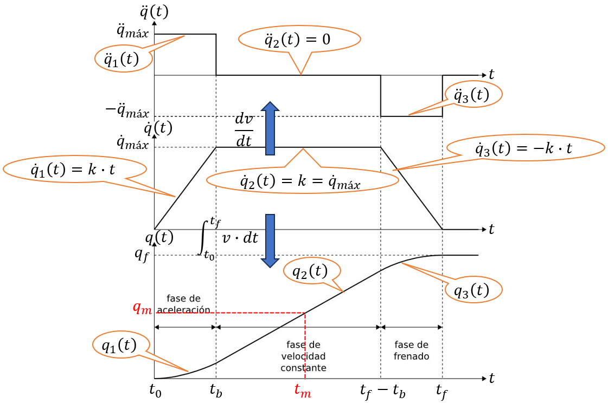

<h1>Aula 10</h1>

Esta clase consiste en comprender y analizar las rutas y las trayectorias con perfil de velocidad trapezoidal de un brazo robótico serial.

<h2>Trayectorias</h2>

Las trayectorias de los robots consisten en realizar tareas de movimiento del robot de un punto inicial a un punto final, en el espacio articular (espacio de movimientos de las articulaciones) o en el espacio operacional del robot (espacio (área o volumen) de trabajo).


<h3>Planeación de ruta (<i>path planning</i>)</h3>

Genera una ruta geométrica, desde un punto inicial hasta un punto final a través de puntos intermedios (waypoints) previamente definidos de manera discontinua (saltos bruscos), donde solo es relevante la posición.

Las rutas con puntos intermedios a través de la interpolación de ángulos del punto A y B generan un resultado circular (MoveJ).


```matlab
%% Ruta 1 (espacio articulacional (MoveJ) - interpolando ángulos)

clear all
close all
clc

l1 = 10;
l2 = 10;
l3 = 10;

% Cinemática inversa
% Punto 1
P1x = 2.456;
P1y = 0.31;
P1z = 26.933;

[theta1_P1, theta2_P1, theta3_P1] = InverseKinematics3R(l1,l2,l3,P1x,P1y,P1z);

% Punto 2
P2x = -9.804;
P2y = 11.851;
P2z = 20.723;

[theta1_P2, theta2_P2, theta3_P2] = InverseKinematics3R(l1,l2,l3,P2x,P2y,P2z);
%

n = 10;
x = 1:1:n;

theta1_P1toP2 = linspace(theta1_P1, theta1_P2, n);
theta2_P1toP2 = linspace(theta2_P1, theta2_P2, n);
theta3_P1toP2 = linspace(theta3_P1, theta3_P2, n);

figure(1)
for i=1:n
    % Cinemática directa (Peter corke)
    [MTH] = ForwardKinematics3R(l1,l2,l3,theta1_P1toP2(i),theta2_P1toP2(i),theta3_P1toP2(i));
    d(:,i) = MTH.t;
    hold on;
    plot3(d(1,i),d(2,i),d(3,i),'.b');
end

figure(2)
tiledlayout(2,1)
ax1 = nexttile;
plot(ax1, x, rad2deg(theta1_P1toP2),'r')
title('Espacio articulacional')
xlabel('Waypoint')
ylabel('Ángulo (°)')
hold on
grid on
plot(ax1, x, rad2deg(theta2_P1toP2),'g')
plot(ax1, x, rad2deg(theta3_P1toP2),'b')
legend('q1','q2','q3','Location','northwest')
hold off
ax2 = nexttile;
plot(ax2, x, d(1,:),'r')
title('Espacio operacional')
xlabel('Waypoint')
ylabel('Posición (m)')
hold on
grid on
plot(ax2, x, d(2,:),'g')
plot(ax2, x, d(3,:),'b')
legend('X','Y','Z','Location','northwest')
hold off
```

Las rutas con puntos intermedios a través de la interpolación de posiciones del punto A y B generan un resultado lineal (MoveL).


```matlab
%% Ruta 2 (espacio operacional (MoveL) - interpolando posiciones)

% clear all
% close all
% clc

l1 = 10;
l2 = 10;
l3 = 10;

% Punto 1
P1x = 2.456;
P1y = 0.31;
P1z = 26.933;

% Punto 2
P2x = -9.804;
P2y = 11.851;
P2z = 20.723;

n = 10
x = 1:1:n

Px_P1toP2 = linspace(P1x, P2x, n);
Py_P1toP2 = linspace(P1y, P2y, n);
Pz_P1toP2 = linspace(P1z, P2z, n);

figure(1)
for i=1:n
    % Cinemática inversa
    [theta1(i), theta2(i), theta3(i)] = InverseKinematics3R(l1,l2,l3,Px_P1toP2(i),Py_P1toP2(i),Pz_P1toP2(i));
    
    % Cinemática directa (Peter corke)
    [MTH] = ForwardKinematics3R(l1,l2,l3,theta1(i),theta2(i),theta3(i));
    hold on;
    plot3(MTH.t(1),MTH.t(2),MTH.t(3),'.r');
end

figure(3)
tiledlayout(2,1)
ax1 = nexttile;
plot(ax1, x, rad2deg(theta1),'r')
title('Espacio articulacional')
xlabel('Waypoint')
ylabel('Ángulo (°)')
hold on
grid on
plot(ax1, x, rad2deg(theta2),'g')
plot(ax1, x, rad2deg(theta3),'b')
legend('q1','q2','q3','Location','northwest')
hold off
ax2 = nexttile;
plot(ax2, x, Px_P1toP2(:),'r')
title('Espacio operacional')
xlabel('Waypoint')
ylabel('Posición (m)')
hold on
grid on
plot(ax2, x, Py_P1toP2(:),'g')
plot(ax2, x, Pz_P1toP2(:),'b')
legend('X','Y','Z','Location','northwest')
hold off
```

<h3>Planeación de trayectoria (<i>trajectory planning</i>)</h3>

A partir de una ruta geométrica determinada, se genera una trayectoria continua (movimiento suave) en función del tiempo, es decir, contemplando las velocidades y las aceleraciones de las articulaciones.

Las trayectorias se pueden obtener a través de diferentes métodos:

- Polinomios
- Perfil de velocidad trapezoidal
- Jacobianos  

<h4>Perfil de velocidad trapezoidal</h4>

El perfil de velocidad trapezoidal también conocido como trayectoria de segmento lineal con dobleces parabólicos (lspb) consiste en tres fases (aceleración, velocidad cruzero y desaceleración).


es realizado en el espacio de las articulaciones. Una de las combinaciones más utilizadas en este perfil es 1/4, 1/2, 1/4; sin embargo, esto depende de la velocidad máxima y el tiempo final.



$$𝑉𝑚á𝑥=\frac{𝑑_1−𝑑_0}{𝑡_𝑓} \cdot 1.5$$

Las trayectorias con puntos intermedios a través de la interpolación de ángulos del punto A y B generan un resultado circular (MoveJ).


```matlab
%% Trayectoria de perfil de velocidad trapezoidal 3R (MoveJ)

% clear all
% close all
% clc

l1 = 10;
l2 = 10;
l3 = 10;

R(1) = Link('revolute','d',l1,'alpha',pi/2,'a',0,'offset',0);
R(2) = Link('revolute','d',0,'alpha',0,'a',l2,'offset',0);
R(3) = Link('revolute','d',0,'alpha',0,'a',l3,'offset',0);

Robot = SerialLink(R,'name','Bender')

%Trayectoria 1 - perfil trapezoidal
t0 = 0
tf = 10
t = linspace(t0,tf,20);

% v1 = [1 0.9]
% v2 = [2 1.8]

% Punto 1
P1x = 2.456;
P1y = 0.31;
P1z = 26.933;

[theta1_P1, theta2_P1, theta3_P1] = InverseKinematics3R(l1,l2,l3,P1x,P1y,P1z);

% Punto 2
P2x = -9.804;
P2y = 11.851;
P2z = 20.723;

[theta1_P2, theta2_P2, theta3_P2] = InverseKinematics3R(l1,l2,l3,P2x,P2y,P2z);

[q1, dq1, ddq1] = TraTra(theta1_P1,theta1_P2,t)
[q2, dq2, ddq2] = TraTra(theta2_P1,theta2_P2,t)
[q3, dq3, ddq3] = TraTra(theta3_P1,theta3_P2,t)

% AT = qf - q0
% dq_max = AT*(2/(1.5*tf))*1.2 %Velocidad de la articulación

figure(4)
title('Articulación 1')
figA = subplot(3,1,1);
%axis([t0 tf -Inf Inf])
grid on
hold on
title('Posición angular')
xlabel('tiempo (s)')
ylabel('ángulo (grados)')

figB = subplot(3,1,2);
%axis([t0 tf -Inf Inf])
grid on
hold on
title('Velocidad angular')
xlabel('tiempo (s)')
ylabel('velocidad (rad/s)')

figC = subplot(3,1,3);
%axis([t0 tf -Inf Inf])
grid on
hold on
title('Aceleración angular')
xlabel('tiempo (s)')
ylabel('aceleración (rad/s^2)')


for i=1:length(q1)
    t_(i,1) = t(i);
    % Gráfica de posición
    q1_(i,1) = rad2deg(q1(i))
    plot(figA,t_(:),q1_(:,1),'-b')
    q2_(i,1) = rad2deg(q2(i))
    plot(figA,t_(:),q2_(:,1),'-g')
    q3_(i,1) = rad2deg(q3(i))
    plot(figA,t_(:),q3_(:,1),'-r')
    % Gráfica de velocidad
    dq1_(i,1) = dq1(i)
    plot(figB,t_(:),dq1_(:,1),'-b')
    dq2_(i,1) = dq2(i)
    plot(figB,t_(:),dq2_(:,1),'-g')
    dq3_(i,1) = dq3(i)
    plot(figB,t_(:),dq3_(:,1),'-r')
    % Gráfica de aceleración
    ddq1_(i,1) = ddq1(i)
    plot(figC,t_(:),ddq1_(:,1),'-b')
    ddq2_(i,1) = ddq2(i)
    plot(figC,t_(:),ddq2_(:,1),'-g')
    ddq3_(i,1) = ddq3(i)
    plot(figC,t_(:),ddq3_(:,1),'-r')
    
    figure(1)
    Robot.teach([q1(i),q2(i),q3(i)],'scale',1.0,'workspace',[-30 30 -30 30 -30 30]);
%     zlim([-15,30]);
    MTH = Robot.fkine([q1(i),q2(i),q3(i)])
    hold on
    plot3(MTH.t(1),MTH.t(2),MTH.t(3),'.g')
end

legend(figA,'q1','q2','q3','Location','northwest')
legend(figB,'dq1','dq2','dq3','Location','southeast')
legend(figC,'d2q1','d2q2','d2q3','Location','northeast')
```

Las trayectorias con puntos intermedios a través de la interpolación de posiciones del punto A y B generan un resultado lineal (MoveL).

![![Interpolación de posiciones PVT 3R]](Imagenes/image-9.png)

```matlab
%% Trayectoria de perfil de velocidad trapezoidal 3R (MoveL)

%clear all
%close all
%clc

l1 = 10;
l2 = 10;
l3 = 10;

R(1) = Link('revolute','d',l1,'alpha',pi/2,'a',0,'offset',0);
R(2) = Link('revolute','d',0,'alpha',0,'a',l2,'offset',0);
R(3) = Link('revolute','d',0,'alpha',0,'a',l3,'offset',0);

Robot = SerialLink(R,'name','Bender')

%Trayectoria 1 - perfil trapezoidal
t0 = 0
tf = 1
t = linspace(t0,tf,20)

% v1 = [1 0.9]
% v2 = [2 1.8]

% Punto 1
P1x = 2.456;
P1y = 0.31;
P1z = 26.933;

% Punto 2
P2x = -9.804;
P2y = 11.851;
P2z = 20.723;

[x1, dx1, ddx1] = TraTra(P1x,P2x,t)
[y2, dy2, ddy2] = TraTra(P1y,P2y,t)
[z3, dz3, ddz3] = TraTra(P1z,P2z,t)

% AT = qf - q0
% dq_max = AT*(2/(1.5*tf))*1.2 %Velocidad de la articulación

figure(5)
title('Articulación 1')
figD = subplot(3,1,1);
%axis([t0 tf -Inf Inf])
grid on
hold on
title('Posición lineal')
xlabel('tiempo (s)')
ylabel('distancia (m)')

figE = subplot(3,1,2);
%axis([t0 tf -Inf Inf])
grid on
hold on
title('Velocidad lineal')
xlabel('tiempo (s)')
ylabel('velocidad (m/s)')

figF = subplot(3,1,3);
%axis([t0 tf -Inf Inf])
grid on
hold on
title('Aceleración lineal')
xlabel('tiempo (s)')
ylabel('aceleración (m/s^2)')


for i=1:length(x1)
    t2_(i,1) = t(i);
    % Gráfica de posición
    x1_(i,1) = x1(i)
    plot(figD,t2_(:),x1_(:,1),'-b')
    y2_(i,1) = y2(i)
    plot(figD,t2_(:),y2_(:,1),'-g')
    z3_(i,1) = z3(i)
    plot(figD,t2_(:),z3_(:,1),'-r')
    % Gráfica de velocidad
    dx1_(i,1) = dx1(i)
    plot(figE,t2_(:),dx1_(:,1),'-b')
    dy2_(i,1) = dy2(i)
    plot(figE,t2_(:),dy2_(:,1),'-g')
    dz3_(i,1) = dz3(i)
    plot(figE,t2_(:),dz3_(:,1),'-r')
    % Gráfica de aceleración
    ddx1_(i,1) = ddx1(i)
    plot(figF,t2_(:),ddx1_(:,1),'-b')
    ddy2_(i,1) = ddy2(i)
    plot(figF,t2_(:),ddy2_(:,1),'-g')
    ddz3_(i,1) = ddz3(i)
    plot(figF,t2_(:),ddz3_(:,1),'-r')
    
    figure(1)
    %Robot.plot([q1T(i),q2T(i),q3T(i)],'scale',1.0,'workspace',[-30 30 -30 30 -30 30]);
    
%     zlim([-15,30]);
    
    [theta1(i), theta2(i), theta3(i)] = InverseKinematics3R(l1,l2,l3,x1(i),y2(i),z3(i));
    Robot.teach([theta1(i),theta2(i),theta3(i)],'scale',1.0,'workspace',[-30 30 -30 30 -30 30]);
    % Cinemática directa (Peter corke)
    MTH = Robot.fkine([theta1(i),theta2(i),theta3(i)])
    hold on
    plot3(MTH.t(1),MTH.t(2),MTH.t(3),'.m')
end

legend(figD,'X','Y','Z','Location','northwest')
legend(figE,'dX','dy','dZ','Location','southeast')
legend(figF,'d2X','d2Y','d2Z','Location','northeast')
```
