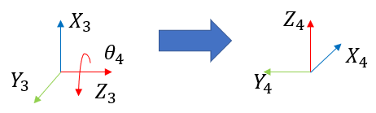
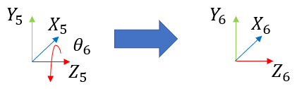

<h1>Aula 10</h1>

Esta clase consiste en comprender y analizar el desacople cinemático, el cual es un método de realizar la cinemática inversa de un robot de 6 GDL.

<h2>Desacople cinemático</h2>

El desacople cinemático consiste en calcular la cinemática inversa de un robot de 6 GDL a partir de la separación de las tres primeras articulaciones (posicionamiento en el centro de la muñeca), las cuales pueden ser cualquier configuración (Cartesiano, Scara, Cilíndrico, Esférico, Angular 3R) y de las tres últimas articulaciones (orientación del efector final), para lo cual, la configuración más utilizada es la muñeca esférica.

La metodología de aplicación del desacople cinemático en un robot de 6 DOF es:

1. Establecer la posición y orientación deseada del TCP y devolver el desplazamiento de l5 y l6 para encontrar la posición en el centro de la muñeca.
2. Realizar la cinemática inversa de las tres primeras articulaciones para determinar la posición en el centro de la muñeca esférica.
3. Determinar la rotación del SC{0} al SC{3} para las tres primeras articulaciones.
4. Encontrar la matriz inversa de la rotación del SC{0} al SC{3}.
5. Determinar la matriz numérica de rotación del SC{3} al SC{6}.
6. Determinar la matriz simbólica de rotación del SC{3} al SC{6}.
7. Igualar las matrices $𝑅_6^3 𝐴$ y $𝑅_6^3 𝐵$ para resolver las últimas tres articulaciones.
8. Verificar la cinemática inversa 6R por el método de desacople cinemático.


<h3>Robot 6R</h3>

El centro de la muñeca es el punto donde las tres primeras articulaciones son las únicas que cambian la posición de dicho punto. En este punto se cruzan los tres ejes de movimiento ($𝑍_3$, $𝑍_4$, $𝑍_5$).


<h3>$R_3^0 = R_1^0 \cdot R_2^1 \cdot R_3^2$</h3>

<h4>$R_1^0$</h4>


$$R_1^0 = 𝑅_𝑍(𝜃_1) \cdot 𝑅_𝑋(𝜋/2)$$

$$R_1^0 = \begin{bmatrix}
𝐶𝜃_1 & -𝑆𝜃_1 & 0 \\ 
𝑆𝜃_1 & 𝐶𝜃_1 & 0 \\ 
0 & 0 & 1 \\ 
\end{bmatrix} \cdot \begin{bmatrix}
1 & 0 & 0 \\ 
0 & 0 & -1 \\ 
0 & 1 & 0 \\ 
\end{bmatrix} = \begin{bmatrix}
𝐶𝜃_1 & 0 & 𝑆𝜃_1 \\ 
𝑆𝜃_1 & 0 & -𝐶𝜃_1 \\ 
0 & 1 & 0 \\ 
\end{bmatrix} 
$$

```matlab
clear all
close all
clc

syms theta1

R01 = RotarZ(theta1)*round(RotarX(pi/2))
```

<h4>$R_2^1$</h4>


$$R_2^1 = 𝑅_𝑍(𝜃_2)$$

$$R_2^1 = \begin{bmatrix}
𝐶𝜃_2 & -𝑆𝜃_2 & 0 \\ 
𝑆𝜃_2 & 𝐶𝜃_2 & 0 \\ 
0 & 0 & 1 \\ 
\end{bmatrix}
$$

```matlab
clear all
close all
clc

syms theta2

R12 = RotarZ(theta2)
```

<h4>$R_3^2$</h4>


$$𝑅_3^2 = 𝑅_𝑍(𝜃_3) \cdot 𝑅_𝑋(𝜋/2) \cdot 𝑅_𝑌(𝜋/2)$$

$$R_3^2 = \begin{bmatrix}
𝐶𝜃_3 & -𝑆𝜃_3 & 0 \\ 
𝑆𝜃_3 & 𝐶𝜃_3 & 0 \\ 
0 & 0 & 1 \\ 
\end{bmatrix} \cdot \begin{bmatrix}
1 & 0 & 0 \\ 
0 & 0 & -1 \\ 
0 & 1 & 0 \\ 
\end{bmatrix} \cdot \begin{bmatrix}
0 & 0 & 1 \\ 
0 & 1 & 0 \\ 
-1 & 0 & 0 \\ 
\end{bmatrix}= \begin{bmatrix}
-𝑆𝜃_3 & 0 & 𝐶𝜃_3 \\ 
𝐶𝜃_3 & 0 & 𝑆𝜃_3 \\ 
0 & 1 & 0 \\ 
\end{bmatrix} 
$$

```matlab
clear all
close all
clc

syms theta3

R23 = RotarZ(theta3)*round(RotarX(pi/2)*RotarY(pi/2))
```

<h3>$R_6^3 = R_4^3 \cdot R_5^4 \cdot R_6^5$</h3>

<h4>$R_4^3$</h4>



$$𝑅_4^3 = 𝑅_𝑍(𝜃_4) \cdot 𝑅_𝑍(−𝜋/2) \cdot 𝑅_𝑋(−𝜋/2)$$

$$R_4^3 = \begin{bmatrix}
𝐶𝜃_4 & -𝑆𝜃_4 & 0 \\ 
𝑆𝜃_4 & 𝐶𝜃_4 & 0 \\ 
0 & 0 & 1 \\ 
\end{bmatrix} \cdot \begin{bmatrix}
0 & 1 & 0 \\ 
-1 & 0 & 0 \\ 
0 & 0 & 1 \\ 
\end{bmatrix} \cdot \begin{bmatrix}
1 & 0 & 0 \\ 
0 & 0 & 1 \\ 
0 & -1 & 0 \\ 
\end{bmatrix}= \begin{bmatrix}
𝑆𝜃_4 & 0 & 𝐶𝜃_4 \\ 
-𝐶𝜃_4 & 0 & 𝑆𝜃_4 \\ 
0 & -1 & 0 \\ 
\end{bmatrix} 
$$

```matlab
clear all
close all
clc

syms theta4

R34 = RotarZ(theta4)*round(RotarZ(-pi/2)*RotarX(-pi/2))
```

<h4>$R_5^4$</h4>


$$𝑅_5^4 = 𝑅_𝑍(𝜃_5) \cdot 𝑅_𝑋(𝜋/2)$$

$$R_5^4 = \begin{bmatrix}
𝐶𝜃_5 & -𝑆𝜃_5 & 0 \\ 
𝑆𝜃_5 & 𝐶𝜃_5 & 0 \\ 
0 & 0 & 1 \\ 
\end{bmatrix} \cdot \begin{bmatrix}
1 & 0 & 0 \\ 
0 & 0 & -1 \\ 
0 & 1 & 0 \\ 
\end{bmatrix} = \begin{bmatrix}
𝐶𝜃_5 & 0 & 𝑆𝜃_5 \\ 
𝑆𝜃_5 & 0 & -𝐶𝜃_5 \\ 
0 & 1 & 0 \\ 
\end{bmatrix} 
$$

```matlab
clear all
close all
clc

syms theta5

R45 = RotarZ(theta5)*round(RotarX(pi/2))
```

<h4>$R_6^5$</h4>



$$𝑅_6^5 = 𝑅_𝑍(𝜃_6)$$

$$R_6^5 = \begin{bmatrix}
𝐶𝜃_6 & -𝑆𝜃_6 & 0 \\ 
𝑆𝜃_6 & 𝐶𝜃_6 & 0 \\ 
0 & 0 & 1 \\ 
\end{bmatrix}
$$

```matlab
clear all
close all
clc

syms theta6

R45 = RotarZ(theta6)
```