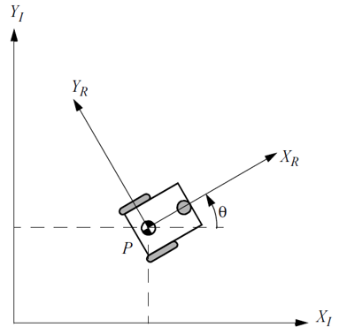

<h1>Aula 13</h1>

Esta clase consiste en comprender la cinemática directa e inversa de la plataforma diferencial y aplicarlas en análisis de recorridos por transiciones y por trayectorias.

<h2>Plataforma diferencial</h2>

Son robots móviles que se componen por un sistema basado en dos ruedas motrices en paralelo, las cuales pueden girar a distinta velocidad.

Fuente: Introduction to Autonomous Mobile Robots. Roland Siegwart and Illah R. Nourbakhsh. 2004

La cinemática directa de la plataforma diferencial es el cálculo de las velocidades de la plataforma, a partir de las velocidades de las ruedas.

$$𝑉_𝑃=\frac{𝑉_𝐷+𝑉_𝐼}{2}$$

$$𝜔_𝑃=\frac{𝑉_𝐷−𝑉_𝐼}{𝐿}$$

Aplicando la relación de velocidades $𝑣=𝜔\cdot 𝑟$

$$𝑉_𝑃=\frac{𝑟_𝑟(𝜔_𝐷+𝜔_𝐼)}{2}$$

$$𝜔_𝑃=\frac{𝑟_𝑟(𝜔_𝐷−𝜔_𝐼)}{𝐿}$$

La cinemática inversa de la plataforma diferencial es el cálculo de las velocidades de las ruedas, a partir de las velocidades de la plataforma.

$$𝜔_𝐼=−\frac{𝐿𝜔_𝑃}{2𝑟_𝑟}+\frac{𝑉_𝑃}{𝑟_𝑟}$$

$$𝜔_𝐷=\frac{𝐿𝜔_𝑃}{2𝑟_𝑟}+\frac{𝑉_𝑃}{𝑟_𝑟}$$

<h3>Ejercicio 1</h3>

Teniendo en cuenta que un robot móvil diferencial, gira en la rueda derecha a 75 𝑅𝑃𝑀 y en la rueda izquierda a 40 𝑅𝑃𝑀. Así mismo, el ancho de la plataforma y el radio de las ruedas es de 12 𝑐𝑚 y 3.5 𝑐𝑚, respectivamente. Determinar:

<ol type="a">
    <li>La velocidad lineal de la plataforma</li>
    <li>La velocidad angular de la plataforma</li>
    <li>El sentido de giro de la plataforma</li>
</ol>

<h3>Ejercicio 2</h3>

Un robot móvil diferencial, gira en la rueda derecha a 0.35 𝑚/𝑠 y en la rueda izquierda a 0.27 𝑚/𝑠, siendo que el radio de las ruedas es de 5 𝑐𝑚 y el ancho de la plataforma es de 9 𝑐𝑚. Si la plataforma acelera angularmente a −0.1 $rad/𝑠^2$ en 5𝑠, determinar:

<ol type="a">
    <li>Las velocidades de las ruedas en RPM</li>
    <li>La velocidad lineal inicial y la velocidad angular inicial de la plataforma</li>
    <li>El radio sobre el cual gira la plataforma</li>
    <li>La aceleración lineal de la plataforma</li>
    <li>La velocidad lineal final y la velocidad angular final de la plataforma</li>
    <li>La velocidad final de la rueda derecha e izquierda</li>
    <li>El sentido de giro de la plataforma</li>
    <li>El número de vueltas de cada una de las ruedas</li>
    <li>La distancia recorrida de cada una de las ruedas</li>
</ol>

<h2>Análisis de recorrido por transiciones</h2>

El análisis de recorrido consiste en analizar cada trayectoria (lineal o angular) de la plataforma robótica, para determinar la posición y la orientación de la misma.

Fuente: Introduction to Autonomous Mobile Robots. Roland Siegwart and Illah R. Nourbakhsh. 2004

$𝑉_𝑃≠0$ y $𝜔_𝑃=0$ 

$𝑉_𝑃=0$ y $𝜔_𝑃≠0$

$𝑉_𝑃=\frac{𝑟_𝑟(𝜔_𝐷+𝜔_𝐼)}{2}$ y $𝜔_𝑃=\frac{𝑟_𝑟(𝜔_𝐷−𝜔_𝐼)}{𝐿}$

$𝜔_𝐼=−\frac{𝐿𝜔_𝑃}{2𝑟_𝑟}+\frac{𝑉_𝑃}{𝑟_𝑟}$ y $𝜔_𝐷=\frac{𝐿𝜔_𝑃}{2𝑟_𝑟}+\frac{𝑉_𝑃}{𝑟_𝑟}$

<h3>Ejercicio 3</h3>

Recorrido 1: Un robot móvil diferencial de ancho de 15 𝑐𝑚 se desplaza a 40° con respecto al eje X durante 7.4𝑠 y gira en las ruedas (𝑟=3.5𝑐𝑚) derecha e izquierda a 28 𝑅𝑃𝑀. Así mismo, las posiciones iniciales de la plataforma en X y Y son de 4 𝑚 y 3 𝑚, respectivamente. Sin aceleración lineal y angular, determinar:

<ol type="a">
    <li>La posición final en X</li>
    <li>La posición final en Y</li>
    <li>El ángulo final de la plataforma</li>
</ol>

<h3>Ejercicio 4</h3>

Recorrido 2: A partir de la trayectoria 1 (ejercicio 1) un robot móvil diferencial gira en las ruedas derecha e izquierda a 20 𝑅𝑃𝑀 y −20 𝑅𝑃𝑀, respectivamente; durante 0.5𝑠. Sin aceleración lineal y angular, determinar:

<ol type="a">
    <li>La posición final en X</li>
    <li>La posición final en Y</li>
    <li>El ángulo final de la plataforma</li>
</ol>

<h3>Ejercicio 5</h3>

Recorrido 3: A partir de la trayectoria 2 (ejercicio 2) un robot móvil diferencial gira en las ruedas derecha e izquierda a −10 𝑅𝑃𝑀; durante 1.5𝑠. Sin aceleración lineal y angular, determinar:

<ol type="a">
    <li>La posición final en X</li>
    <li>La posición final en Y</li>
    <li>El ángulo final de la plataforma</li>
</ol>

<h3>Ejercicio 6</h3>

Recorrido 4: A partir de la trayectoria 3 (ejercicio 3) un robot móvil diferencial gira en las ruedas derecha e izquierda a −5 𝑅𝑃𝑀 y 5 𝑅𝑃𝑀, respectivamente; durante 3𝑠. Sin aceleración lineal y angular, determinar:

<ol type="a">
    <li>La posición final en X</li>
    <li>La posición final en Y</li>
    <li>El ángulo final de la plataforma</li>
</ol>

<h2>Análisis de recorrido por trayectorias</h2>

El análisis de recorrido por trayectorias consiste en analizar una trayectoria circular de la plataforma robótica, linealizando dicha trayectoria a través de puntos intermedios equidistantes en tiempo, para determinar la posición y la orientación de la misma.

$𝑉_𝑃≠0$ y $𝜔_𝑃≠0$ 

$𝑉_𝑃=\frac{𝑟_𝑟(𝜔_𝐷+𝜔_𝐼)}{2}$ y $𝜔_𝑃=\frac{𝑟_𝑟(𝜔_𝐷−𝜔_𝐼)}{𝐿}$

$𝜔_𝐼=−\frac{𝐿𝜔_𝑃}{2𝑟_𝑟}+\frac{𝑉_𝑃}{𝑟_𝑟}$ y $𝜔_𝐷=\frac{𝐿𝜔_𝑃}{2𝑟_𝑟}+\frac{𝑉_𝑃}{𝑟_𝑟}$

Fuente: Introduction to Autonomous Mobile Robots. Roland Siegwart and Illah R. Nourbakhsh. 2004

$$𝑉_𝑃=\frac{∆𝑑}{∆𝑡}=\frac{𝑑_1−𝑑_0}{∆𝑡}$$

$$𝑑_1=𝑑_0+𝑉_𝑃 \cdot ∆𝑡$$

$$𝑋_𝑘=𝑋_{𝑘−1}+𝑉_{𝑃_{𝑋_{𝑘−1}}} \cdot ∆𝑡$$

$$𝑌_𝑘=𝑌_{𝑘−1}+𝑉_{𝑃_{𝑌_{𝑘−1}}} \cdot ∆𝑡$$

$$𝜃_𝑘=𝜃_{𝑘−1}+𝜔_𝑃 \cdot ∆𝑡$$

$$𝑉_{𝑃_{𝑋_𝑘}}=𝑉_𝑃 \cdot cos⁡𝜃_𝑘$$

$$𝑉_{𝑃_{𝑌_𝑘}}=𝑉_𝑃 \cdot sin𝜃_𝑘$$

<h3>Ejercicio 7</h3>

Trayectoria 1: Un robot móvil diferencial de ancho de 15 𝑐𝑚 se desplaza a 30° con respecto al eje X durante 4𝑠 y gira en las ruedas (𝑟=3𝑐𝑚) derecha a 35 𝑅𝑃𝑀 e izquierda a 25 𝑅𝑃𝑀. Así mismo, las posiciones iniciales de la plataforma en X y Y son de 3 𝑚 y 2 𝑚, respectivamente. Tener en cuenta un tiempo de muestreo de 1s. Sin aceleración lineal y angular, determinar:

<ol type="a">
    <li>La posición final en X</li>
    <li>La posición final en Y</li>
    <li>El ángulo final de la plataforma</li>
</ol>

<h3>Ejercicio 8</h3>

Trayectoria 2: A partir del recorrido 1 (ejercicio 1) un robot móvil diferencial gira en las ruedas derecha a 25 𝑅𝑃𝑀 e izquierda a 35 𝑅𝑃𝑀, respectivamente; durante 4𝑠. Tener en cuenta un tiempo de muestreo de 0.25s. Sin aceleración lineal y angular, determinar:

<ol type="a">
    <li>La posición final en X</li>
    <li>La posición final en Y</li>
    <li>El ángulo final de la plataforma</li>
</ol>
