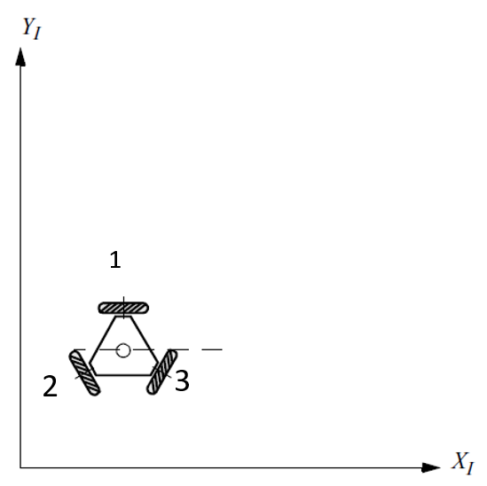

<h1>Aula 14</h1>

Esta clase consiste en comprender la cinemática directa e inversa de la plataforma omnidireccional de 3 ruedas y aplicarlas en análisis de recorridos por transiciones y por trayectorias.

<h2>Plataforma omnidireccional de 3 ruedas</h2>

Una plataforma omnidireccional (holonómica) no tiene restricciones de movimientos, es decir, puede desplazarse hacia cualquier dirección y sentido sin girar.

Fuente: Introduction to Autonomous Mobile Robots. Roland Siegwart and Illah R. Nourbakhsh. 2004

$$ \begin{bmatrix}
𝑉_{𝑝𝑥}\\ 
𝑉_{𝑝𝑦}\\ 
𝜔_{𝑝}\\ 
\end{bmatrix} = \begin{bmatrix}
-1 & 1/2 & 1/2\\ 
0 & -\sqrt{3/2} & \sqrt{3/2}\\ 
1/d & 1/d & 1/d \\ 
\end{bmatrix} \cdot \begin{bmatrix}
𝑉_1\\ 
𝑉_2\\ 
V_3\\ 
\end{bmatrix}$$

$$ \begin{bmatrix}
𝑉_{𝑝𝑥}\\ 
𝑉_{𝑝𝑦}\\ 
𝜔_{𝑝}\\ 
\end{bmatrix} = r_r\begin{bmatrix}
-1 & 1/2 & 1/2\\ 
0 & -\sqrt{3/2} & \sqrt{3/2}\\ 
1/d & 1/d & 1/d \\ 
\end{bmatrix} \cdot \begin{bmatrix}
𝜔_1\\ 
𝜔_2\\ 
𝜔_3\\ 
\end{bmatrix}$$

$$ \begin{bmatrix}
𝜔_1\\ 
𝜔_2\\ 
𝜔_3\\ 
\end{bmatrix} = 1/r_r\begin{bmatrix}
-2/3 & 0 & d/3\\ 
1/3 & -\sqrt{3/3} & d/3\\ 
1/3 & \sqrt{3/3} & d/3 \\ 
\end{bmatrix} \cdot \begin{bmatrix}
𝑉_{𝑝𝑥}\\ 
𝑉_{𝑝𝑦}\\ 
𝜔_{𝑝}\\ 
\end{bmatrix}$$

<h3>Ejercicio 1</h3>

Teniendo en cuenta que una plataforma omnidireccional (holonómica), gira en la rueda 1, 2 y 3 a 10 𝑅𝑃𝑀. Así mismo, la distancia del centro de la plataforma a las ruedas y el radio de las ruedas es de 12 𝑐𝑚 y 3.5 𝑐𝑚, respectivamente. Determinar:

<ol type="a">
    <li> La velocidad lineal de la plataforma en el eje X</li>
    <li> La velocidad lineal de la plataforma en el eje Y</li>
    <li> La velocidad angular de la plataforma</li>
</ol>

<h3>Ejercicio 2</h3>

Teniendo en cuenta que una plataforma omnidireccional (holonómica), gira en la rueda 1 a 30 𝑅𝑃𝑀, en la rueda 2 a 20 𝑅𝑃𝑀 y en la rueda 3 a 10 𝑅𝑃𝑀. Así mismo, la distancia del centro de la plataforma a las ruedas y el radio de las ruedas es de 12 𝑐𝑚 y 3.5 𝑐𝑚, respectivamente. Determinar:

<ol type="a">
    <li> La velocidad lineal de la plataforma en el eje X</li>
    <li> La velocidad lineal de la plataforma en el eje Y</li>
    <li> La velocidad angular de la plataforma</li>
</ol>

<h3>Ejercicio 3</h3>

Teniendo en cuenta la plataforma omnidireccional (holonómica) “robotino” en Coppelia Sim, simular el comportamiento de dicho robot con diferentes velocidades en las ruedas y determinar a través de Matlab:

$$𝜔_1=𝜔_2=𝜔_3$$

$$𝜔_1>𝜔_2>𝜔_3$$

$$𝜔_1>𝜔_3>𝜔_2$$

$$𝜔_3>𝜔_1>𝜔_2$$

$$𝜔_2>𝜔_1>𝜔_3$$

$$𝜔_2>𝜔_3>𝜔_1$$

$$𝜔_3>𝜔_2>𝜔_1$$

$$𝜔_1=𝜔_2>𝜔_3$$

$$𝜔_1=𝜔_2<𝜔_3$$

$$𝜔_1>𝜔_2=𝜔_3$$

$$𝜔_1<𝜔_2=𝜔_3$$

$$𝜔_1=𝜔_3>𝜔_2$$

$$𝜔_1=𝜔_3<𝜔_2$$

<ol type="a">
    <li> La velocidad lineal de la plataforma en el eje X</li>
    <li> La velocidad lineal de la plataforma en el eje Y</li>
    <li> La velocidad angular de la plataforma</li>
</ol>

<h3>Ejercicio 4</h3>

Teniendo en cuenta la plataforma omnidireccional (holonómica) “robotino” en Coppelia Sim, simular el comportamiento de dicho robot con diferentes movimientos (adelante, atrás, izquierda, derecha, giros y avances inclinados) de la plataforma y determinar a través de Matlab:

<ol type="a">
    <li> La velocidad angular de la rueda 1</li>
    <li> La velocidad angular de la rueda 2</li>
    <li> La velocidad angular de la rueda 3</li>
</ol>