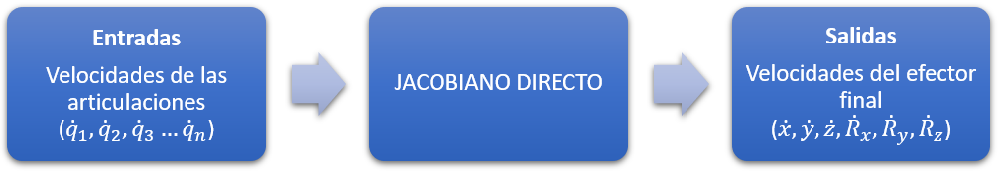
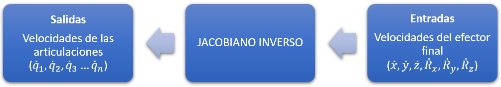

<h1>Aula 15</h1>

Esta clase consiste en comprender y analizar los Jacobianos.

<h2>Jacobianos</h2>

Los jacobianos directo e inverso permiten obtener las velocidades del TCP a partir de las velocidades de las articulaciones y viceversa, respectivamente; además, es posible realizar el análisis a través de jacobiano análitico y geométrico.

1. Calcular las velocidades del TCP y/o articulaciones
2. Calcular la cinemática inversa
3. Calcular trayectorias

<h3>Jacobiano directo</h3>

El Jacobiano directo permite determinar las velocidades del efector final a partir de las velocidades de las articulaciones.



<h3>Jacobiano analítico directo</h3>

El Jacobiano analítico directo consiste en calcular la matriz Jacobiana, la cual se compone de las derivadas parciales de las funciones del efector final con respecto a los movimientos de las articulaciones.

$$
\begin{bmatrix}
\dot{x} \\ 
\dot{y} \\ 
\dot{z} \\
\dot{R}_x \\
\dot{R}_y \\
\dot{R}_z \\ 
\end{bmatrix} = 𝐽 \cdot \begin{bmatrix}
\dot{q}_1 \\ 
⋮ \\ 
\dot{q}_n \\ 
\end{bmatrix}
$$

Siendo $𝐽$ la matriz Jacobiana, expresada por:

$$
𝐽 = \begin{bmatrix}
\frac{𝑑𝑓_𝑥}{𝑑𝑞_1} & ⋯ & \frac{𝑑𝑓_𝑥}{𝑑𝑞_𝑛} \\ 
⋮ & ⋱ & ⋮ \\ 
\frac{𝑑𝑓_{𝑅_𝑧}}{𝑑𝑞_1} & ⋯ & \frac{𝑑𝑓_{𝑅_𝑧}}{𝑑𝑞_𝑛}\\ 
\end{bmatrix} 
$$

<h3>Robot 2R (planar)</h3>


Teniendo en cuenta las siguientes ecuaciones de la cinemática directa de un robot 2R:

$$𝑥=𝑙_1cos⁡(𝜃_1)+𝑙_2cos⁡(𝜃_1+𝜃_2)$$

$$𝑦=𝑙_1sen⁡(𝜃_1)+𝑙_2sen⁡(𝜃_1+𝜃_2)$$

$$𝑧=ℎ_1−ℎ_2$$

Derivando cada función con respecto a las dos articulaciones, se obtiene la siguiente matriz Jacobiana:

$$
𝐽 = \begin{bmatrix}
\frac{𝑑𝑓_𝑥}{𝑑𝜃_1} & \frac{𝑑𝑓_𝑥}{𝑑𝜃_2} \\ 
\frac{𝑑𝑓_y}{𝑑𝜃_1} & \frac{𝑑𝑓_y}{𝑑𝜃_2} \\ 
\frac{𝑑𝑓_z}{𝑑𝜃_1} & \frac{𝑑𝑓_z}{𝑑𝜃_2} \\ 
\end{bmatrix} = \begin{bmatrix}
-𝑙_1sen⁡(𝜃_1)-𝑙_2sen⁡(𝜃_1+𝜃_2) & -𝑙_2sen(𝜃_1+𝜃_2) \\ 
𝑙_1cos(𝜃_1)+𝑙_2cos⁡(𝜃_1+𝜃_2) & 𝑙_2cos⁡(𝜃_1+𝜃_2)\\ 
0 & 0\\ 
\end{bmatrix} 
$$

```matlab
clear all
close all
clc

syms l1 l2 h1 h2 theta1 theta2

x = l1*cos(theta1)+l2*cos(theta1+theta2)
y = l1*sin(theta1)+l2*sin(theta1+theta2)
z = h1 - h2

Js = [diff(x,theta1) diff(x,theta2);
      diff(y,theta1) diff(y,theta2);
      diff(z,theta1) diff(z,theta2);]
```

<h4>Ejemplo</h4>

Si el robot 2R tiene las siguientes características: $l_1=l_2=5cm, 𝜃_1=𝜋/6, 𝜃_2=𝜋/4, \dot{𝜃}_1=𝜋/2, \dot{𝜃}_2=𝜋/2$, cuáles son las velocidades lineales del TCP?

$$
\begin{bmatrix}
\dot{x} \\ 
\dot{y} \\ 
\dot{z} \\
\end{bmatrix} = \begin{bmatrix}
-𝑙_1sen⁡(𝜋/6)-𝑙_2sen⁡(5𝜋/12) & -𝑙_2sen(5𝜋/12) \\ 
𝑙_1cos(𝜋/6)+𝑙_2cos⁡(5𝜋/12) & 𝑙_2cos⁡(5𝜋/12)\\ 
0 & 0\\ 
\end{bmatrix} \cdot \begin{bmatrix}
𝜋/2 \\ 
𝜋/2 \\ 
\end{bmatrix}
$$

$$
\begin{bmatrix}
\dot{x} \\ 
\dot{y} \\ 
\dot{z} \\
\end{bmatrix} = \begin{bmatrix}
-7.3296 & -4.8296 \\ 
5.6242 & 1.2941 \\ 
0 & 0\\ 
\end{bmatrix} \cdot \begin{bmatrix}
1.5708 \\ 
1.5708 \\ 
\end{bmatrix} = \begin{bmatrix}
-19.0997 \\ 
10.8673 \\ 
0 \\
\end{bmatrix}
$$

```matlab
l1 = 5
l2 = 5

theta1 = pi/6
theta2 = pi/4

theta1_dot = pi/2 %rad/s
theta2_dot = pi/2 %rad/s

Jn = [-l2*sin(theta1+theta2)-l1*sin(theta1) -l2*sin(theta1 + theta2);
      l2*cos(theta1+theta2)+l1*cos(theta1)  l2*cos(theta1 + theta2);
      0 0]

Vxyz = Jn*[theta1_dot; theta2_dot]
```

<h3>Jacobiano geométrico directo</h3>

El Jacobiano geométrico directo consiste en aplicar la generalidad para cada articulación.

<h4>Articulación prismática</h4>

$$R_{i-1}^{0} \cdot \begin{bmatrix}
0 \\ 
0 \\ 
1 \\
\end{bmatrix}$$

$$\begin{bmatrix}
0 \\ 
0 \\ 
0 \\
\end{bmatrix}$$

<h4>Articulación rotacional</h4>

$$R_{i-1}^{0} \cdot \begin{bmatrix}
0 \\ 
0 \\ 
1 \\
\end{bmatrix}\times(d_k^0-d_{i-1}^0)$$

$$R_{i-1}^{0} \cdot \begin{bmatrix}
0 \\ 
0 \\ 
1 \\
\end{bmatrix}$$

Donde: 

i = articulación actual<br>
k = número de articulaciones

Siendo $J_{mxn}$ la matriz Jacobiana, expresada por:

Donde, n = número de articulaciones y m = número de velocidades del TCP

$$J = \begin{bmatrix}
R_{i-1}^{0} \cdot \begin{bmatrix}
0 \\ 
0 \\ 
1 \\
\end{bmatrix}\times(d_k^0-d_{i-1}^0) & R_{i-1}^{0} \cdot \begin{bmatrix}
0 \\ 
0 \\ 
1 \\
\end{bmatrix}\times(d_k^0-d_{i-1}^0) \\ 
R_{i-1}^{0} \cdot \begin{bmatrix}
0 \\ 
0 \\ 
1 \\
\end{bmatrix} & R_{i-1}^{0} \cdot \begin{bmatrix}
0 \\ 
0 \\ 
1 \\
\end{bmatrix}\\ 
\end{bmatrix}
$$

La primera y la segunda columna son equivalentes a la primera articulación y segunda articulación, respectivamente.

$$J = \begin{bmatrix}
R_{0}^{0} \cdot \begin{bmatrix}
0 \\ 
0 \\ 
1 \\
\end{bmatrix}\times(d_2^0-d_{0}^0) & R_{1}^{0} \cdot \begin{bmatrix}
0 \\ 
0 \\ 
1 \\
\end{bmatrix}\times(d_2^0-d_{1}^0) \\ 
R_{0}^{0} \cdot \begin{bmatrix}
0 \\ 
0 \\ 
1 \\
\end{bmatrix} & R_{1}^{0} \cdot \begin{bmatrix}
0 \\ 
0 \\ 
1 \\
\end{bmatrix}\\ 
\end{bmatrix}
$$

Las MTHs de la primera y segunda articulación son:

$$ 𝑇_2^1 = 𝑇_0^1 = \begin{bmatrix}
cos⁡(𝜃_1) & -sen⁡(𝜃_1) & 0 & 𝑙_1 \cdot cos⁡(𝜃_1)\\ 
sen⁡(𝜃_1) & cos⁡(𝜃_1) & 0 & 𝑙_1 \cdot sen⁡(𝜃_1)\\ 
0 & 0 & 1 & 0\\ 
0 & 0 & 0 & 1
\end{bmatrix}$$

$$𝑇_3^2 = 𝑇_2^1 = \begin{bmatrix}
cos⁡(𝜃_2) & -sen⁡(𝜃_2) & 0 & 𝑙_2 \cdot cos⁡(𝜃_2)\\ 
sen⁡(𝜃_2) & cos⁡(𝜃_2) & 0 & 𝑙_2 \cdot sen⁡(𝜃_2)\\ 
0 & 0 & 1 & 0\\ 
0 & 0 & 0 & 1
\end{bmatrix}$$

$$𝑇_3^1 = 𝑇_2^0 = \begin{bmatrix}
cos⁡(𝜃_1+𝜃_2) & -sen⁡(𝜃_1+𝜃_2) & 0 & 𝑙_1 \cdot cos(𝜃_1) + 𝑙_2 \cdot cos⁡(𝜃_1+𝜃_2)\\ 
sen⁡(𝜃_1+𝜃_2) & cos⁡(𝜃_1+𝜃_2) & 0 & 𝑙_1 \cdot sen(𝜃_1) + 𝑙_2 \cdot sen⁡(𝜃_1+𝜃_2)\\ 
0 & 0 & 1 & 0\\ 
0 & 0 & 0 & 1
\end{bmatrix}$$

Por tanto, la matriz Jacobiana es:

$$J = \begin{bmatrix}
\begin{bmatrix}
1 & 0 & 0 \\ 
0 & 1 & 0\\ 
0 & 0 & 1 \\
\end{bmatrix} \cdot \begin{bmatrix}
0 \\ 
0 \\ 
1 \\
\end{bmatrix}\times(\begin{bmatrix}
𝑙_1 \cdot cos(𝜃_1) + 𝑙_2 \cdot cos⁡(𝜃_1+𝜃_2) \\ 
𝑙_1 \cdot sen(𝜃_1) + 𝑙_2 \cdot sen(𝜃_1+𝜃_2) \\ 
1 \\
\end{bmatrix}-\begin{bmatrix}
0 \\ 
0 \\ 
0 \\
\end{bmatrix}) & \begin{bmatrix}
cos⁡(𝜃_1) & -sen⁡(𝜃_1) & 0 \\ 
sen⁡(𝜃_1) & cos⁡(𝜃_1) & 0 \\ 
0 & 0 & 1 \\
\end{bmatrix} \cdot \begin{bmatrix}
0 \\ 
0 \\ 
1 \\
\end{bmatrix}\times(\begin{bmatrix}
𝑙_1 \cdot cos(𝜃_1) + 𝑙_2 \cdot cos⁡(𝜃_1+𝜃_2) \\ 
𝑙_1 \cdot sen(𝜃_1) + 𝑙_2 \cdot sen(𝜃_1+𝜃_2) \\ 
1 \\
\end{bmatrix}-\begin{bmatrix}
𝑙_1 \cdot cos(𝜃_1) \\ 
𝑙_1 \cdot sen(𝜃_1) \\ 
0 \\
\end{bmatrix}) \\ 
\begin{bmatrix}
1 & 0 & 0 \\ 
0 & 1 & 0\\ 
0 & 0 & 1 \\
\end{bmatrix} \cdot \begin{bmatrix}
0 \\ 
0 \\ 
1 \\
\end{bmatrix} & \begin{bmatrix}
cos⁡(𝜃_1) & -sen⁡(𝜃_1) & 0 \\ 
sen⁡(𝜃_1) & cos⁡(𝜃_1) & 0 \\ 
0 & 0 & 1 \\
\end{bmatrix} \cdot \begin{bmatrix}
0 \\ 
0 \\ 
1 \\
\end{bmatrix}\\ 
\end{bmatrix}
$$


$$
𝐽 = \begin{bmatrix}
\frac{𝑑𝑓_𝑥}{𝑑𝜃_1} & \frac{𝑑𝑓_𝑥}{𝑑𝜃_2} \\ 
\frac{𝑑𝑓_y}{𝑑𝜃_1} & \frac{𝑑𝑓_y}{𝑑𝜃_2} \\ 
\frac{𝑑𝑓_z}{𝑑𝜃_1} & \frac{𝑑𝑓_z}{𝑑𝜃_2} \\ 
\end{bmatrix} = \begin{bmatrix}
-𝑙_1sen⁡(𝜃_1)-𝑙_2sen⁡(𝜃_1+𝜃_2) & -𝑙_2sen(𝜃_1+𝜃_2) \\ 
𝑙_1cos(𝜃_1)+𝑙_2cos⁡(𝜃_1+𝜃_2) & 𝑙_2cos⁡(𝜃_1+𝜃_2)\\ 
0 & 0\\ 
\end{bmatrix} 
$$

```matlab
clc
clear all
close all

syms theta1 theta2 l1 l2

%% SIMBÓLICO

R00 = eye(3,3)
d00 = zeros(3,1)

%Matriz (DH) 
% MTH T12
TZ0 = [1 0 0 0; 0 1 0 0; 0 0 1 0; 0 0 0 1]
RZ0 = [cos(theta1) -sin(theta1) 0 0; sin(theta1) cos(theta1) 0 0; 0 0 1 0; 0 0 0 1]
TX1 = [1 0 0 l1; 0 1 0 0; 0 0 1 0; 0 0 0 1]
RZ1 = [1 0 0 0; 0 cos(0) -sin(0) 0; 0 sin(0) cos(0) 0; 0 0 0 1]
%T01 =  TZ0*RZ0*TX1*RZ1
T01 =  RZ0*TZ0*TX1*RZ1

% MTH T23
TZ1 = [1 0 0 0; 0 1 0 0; 0 0 1 0; 0 0 0 1]
RZ1 = [cos(theta2) -sin(theta2) 0 0; sin(theta2) cos(theta2) 0 0; 0 0 1 0; 0 0 0 1]
TX2 = [1 0 0 l2; 0 1 0 0; 0 0 1 0; 0 0 0 1]
RZ2 = [1 0 0 0; 0 cos(0) -sin(0) 0; 0 sin(0) cos(0) 0; 0 0 0 1]
% T12 =  TZ1*RZ1*TX2*RZ2
T12 =  RZ1*TZ1*TX2*RZ2

T02 = simplify(T01*T12)
d02 = T02(1:3,4)

R01 = RotarZ(theta1)
d01 = T01(1:3,4)

% Jacobianos con las 6 velocidades (vx, vy, vz, wx, wy y wz)
j11 = cross((R00*[0;0;1]),(d02-d00))
j21 = R00*[0;0;1]
j12 = cross((R01*[0;0;1]),(d02-d01))
j22 = R01*[0;0;1]
j = [j11 j12; j21 j22]
```

<h3>Jacobiano inverso</h3>

El Jacobiano inverso permite determinar las velocidades de las articulaciones a partir de las velocidades del efector final.



<h3>Jacobiano analítico inverso</h3>

El Jacobiano analítico inverso consiste en calcular la matriz inversa Jacobiana, la cual se compone de las derivadas parciales de las funciones de los movimientos de las articulaciones con respecto a las variables del efector final.

$$𝐽{^-1} \cdot \begin{bmatrix}
\dot{x} \\ 
\dot{y} \\ 
\dot{z} \\
\dot{R}_x \\
\dot{R}_y \\
\dot{R}_z \\ 
\end{bmatrix} = \begin{bmatrix}
\dot{q}_1 \\ 
⋮ \\ 
\dot{q}_n \\ 
\end{bmatrix}
$$

<!-- 1. A partir de la matriz inversa del Jacobiano analítico directo, sin embargo, se debe tener en cuenta que la matriz $J$ debe ser cuadradada.

$$
𝐽^{-1} = \begin{bmatrix}
\frac{cos⁡(𝜃_1+𝜃_2)}{l_1sen⁡(𝜃_2)} & \frac{sen(𝜃_1+𝜃_2)}{l_1sen⁡(𝜃_2)} \\ 
\frac{l_2cos⁡(𝜃_1+𝜃_2)+l1cos⁡(𝜃_1)}{l_1l_2sen⁡(𝜃_2)} & \frac{l_2sen(𝜃_1+𝜃_2)+l1sen⁡(𝜃_1)}{l_1l_2sen⁡(𝜃_2)} \\  
\end{bmatrix}
$$

```matlab
Js_1 = simplify(inv(Js))
``` -->

Siendo $J^{-1}$ la matriz inversa Jacobiana, expresada por:

$$𝐽^{-1} = \begin{bmatrix}
\frac{𝑑𝑓_{𝑞_1}}{𝑑f_𝑥} & ⋯ & \frac{𝑑𝑓_{𝑞_1}}{𝑑f_{R_z}} \\ 
⋮ & ⋱ & ⋮ \\ 
\frac{𝑑𝑓_{𝑞_n}}{𝑑f_x} & ⋯ & \frac{𝑑𝑓_{𝑞_𝑛}}{𝑑f_{R_𝑧}}\\ 
\end{bmatrix} 
$$