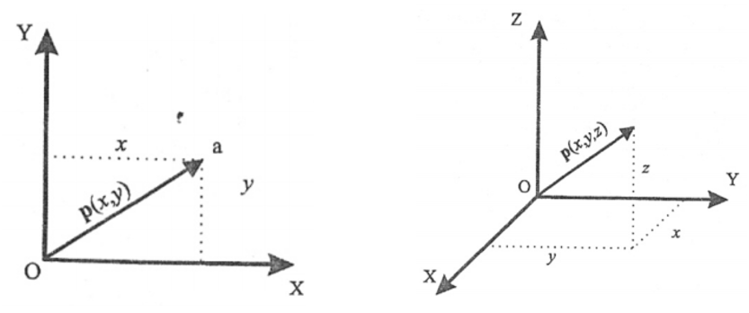
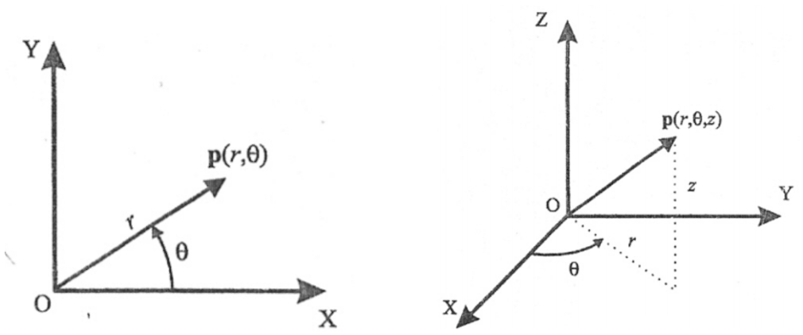
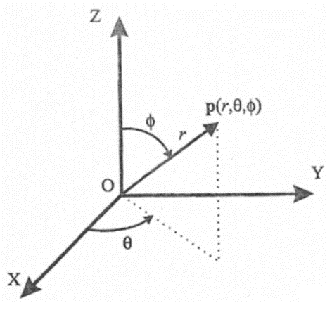
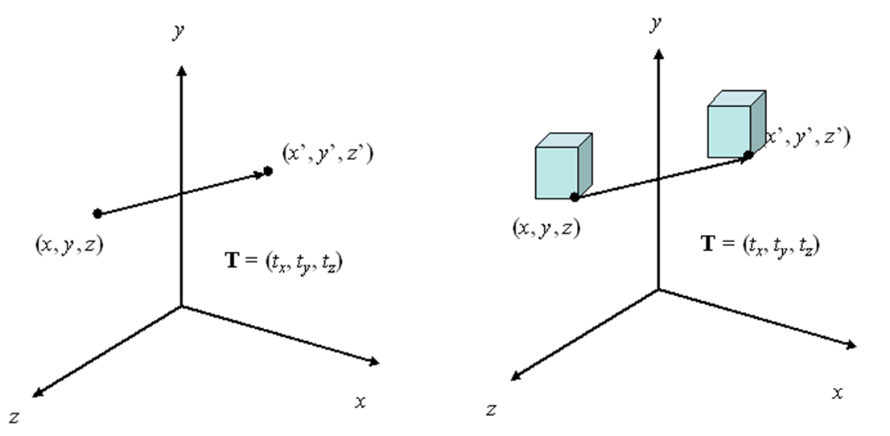
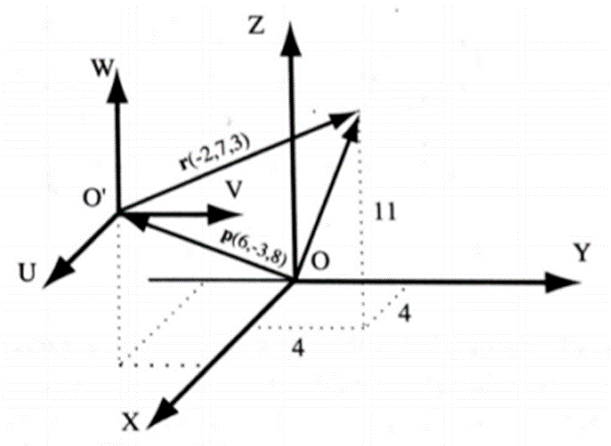
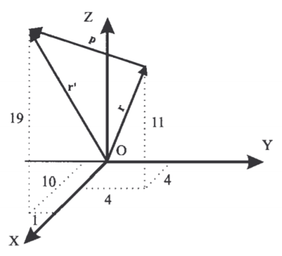

<h1>Aula 2</h1>

Esta clase está basada en comprender los conceptos de posición y orientación de un cuerpo rígido y su representación a través de matrices.

<h2>Posición y orientación del cuerpo rígido y matrices de rotación</h2>

<h3>Coordenadas cartesianas</h3>

Fuente: Barrientos, A., Peñín, L.F., Balaguer, C., y Aracil, R., 2007, Fundamentos de Robótica, 2nd edition, McGraw-Hill.

<h3>Coordenadas polares (2D) y cilíndricas (3D)</h3>

Fuente: Barrientos, A., Peñín, L.F., Balaguer, C., y Aracil, R., 2007, Fundamentos de Robótica, 2nd edition, McGraw-Hill.

<h3>Coordenadas esféricas</h3>

Fuente: Barrientos, A., Peñín, L.F., Balaguer, C., y Aracil, R., 2007, Fundamentos de Robótica, 2nd edition, McGraw-Hill.

<h3>Conversión de coordenadas</h3>

Encontrar la representación en coordenadas cilíndricas y esféricas de vector de coordenadas cartesianas en el sistema OXYZ (4,7,3)

<h2>Cilíndricas</h2>

$$𝑟=  \sqrt{𝑥^{2}+𝑦^{2}}=8.062$$

$$𝜃=tan^{−1}\frac{𝑦}{𝑥}=60.255°$$

$$𝑧=𝑧=3$$

<h2>Esféricas</h2>

$$𝑟=sqrt{𝑥^{2}+𝑦^{2}+𝑧^{2}}=8.602$$

$$𝜃=tan^{−1}⁡\frac{𝑦}{𝑥}=60.255°$$

$$𝜑=cos^{−1}\frac{𝑧}{𝑟}=69.588°$$

<h3>Posición y orientación</h3>

La posición (traslación) es el punto en la coordenada XYZ y la orientación (rotación) es la localización de los ejes alrededor de dicho punto con respecto a un sistema coordenado de origen (cuerpo rígido). Cada articulación tiene un sistema coordenado.

Fuente: http://www.udesantiagovirtual.cl/moodle2/pluginfile.php?file=/55554/mod_book/chapter/285/figuras/Ch3_fig3-1.svg

<h3>Traslación</h3>

La traslación consiste en desplazar un objeto linealmente (modificar la posición) sobre los ejes de un plano cartesiano XYZ.

Fuente: http://galia.fc.uaslp.mx/~medellin/Applets/Trans3D/transformaciones_en_3d.htm

<h2>Ejercicio 1</h2>

En la figura, el sistema 𝑂’𝑈𝑉𝑊 está trasladado de un vector 𝑝(6,−3,8) con respecto del sistema 𝑂𝑋𝑌𝑍. Calcular las coordenadas ($𝑟_{𝑥}$, $𝑟_{𝑦}$, $𝑟_{𝑧}$) del vector 𝑟, cuyas coordenadas con respecto al sistema 𝑂’𝑈𝑉𝑊 son $𝑟_{𝑢𝑣𝑤}$ (−2,7,3)

Fuente: Barrientos, A., Peñín, L.F., Balaguer, C., y Aracil, R., 2007, Fundamentos de Robótica, 2nd edition, McGraw-Hill.

$$\vec{p}= \begin{bmatrix}
6\\ 
-3\\ 
8
\end{bmatrix}$$

$$\vec{r}= \begin{bmatrix}
-2\\ 
7\\ 
3
\end{bmatrix}$$

$$\vec{p}+\vec{r}= \begin{bmatrix}
6\\ 
-3\\ 
8
\end{bmatrix} + \begin{bmatrix}
-2\\ 
7\\ 
3
\end{bmatrix} = \begin{bmatrix}
4\\ 
4\\ 
11
\end{bmatrix}$$

<h2>Ejercicio 2</h2>

Calcular el vector ${𝑟_{𝑥𝑦𝑧}}'$ resultante de trasladar el vector $𝑟_{𝑥𝑦𝑧}$ (4,4,11) las coordenadas $𝑝_{𝑥𝑦𝑧}$ (6,−3,8)

Fuente: Barrientos, A., Peñín, L.F., Balaguer, C., y Aracil, R., 2007, Fundamentos de Robótica, 2nd edition, McGraw-Hill.

$$\vec{r}= \begin{bmatrix}
4\\ 
4\\ 
11
\end{bmatrix}$$

$$\vec{r}= \begin{bmatrix}
6\\ 
-3\\ 
8
\end{bmatrix}$$

$$\vec{p}+\vec{r}= \begin{bmatrix}
4\\ 
4\\ 
11
\end{bmatrix} + \begin{bmatrix}
6\\ 
-3\\ 
8
\end{bmatrix} = \begin{bmatrix}
10\\ 
1\\ 
19
\end{bmatrix}$$

<h3></h3>
<h3></h3>