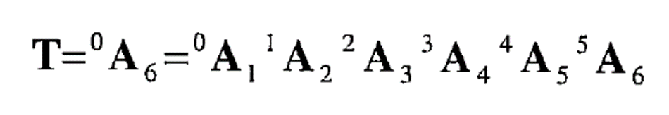
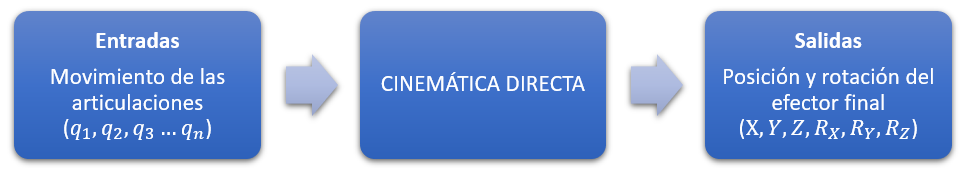
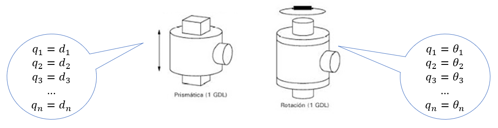
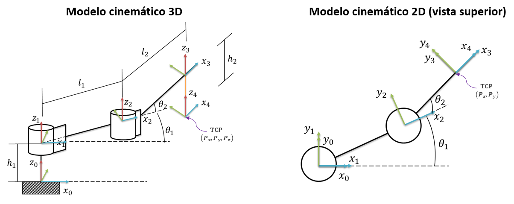
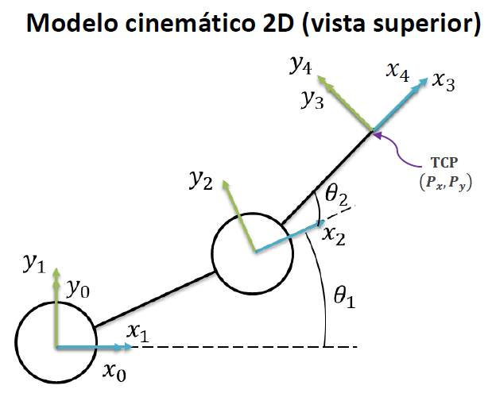
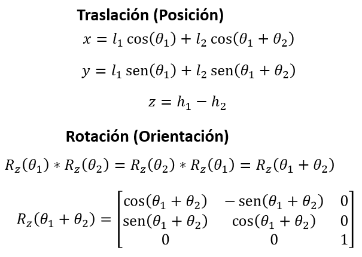
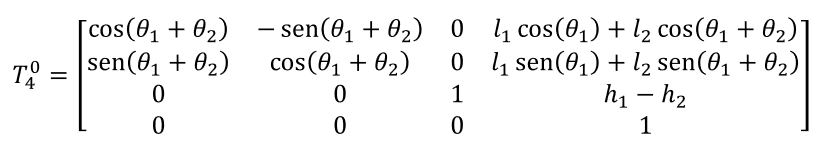
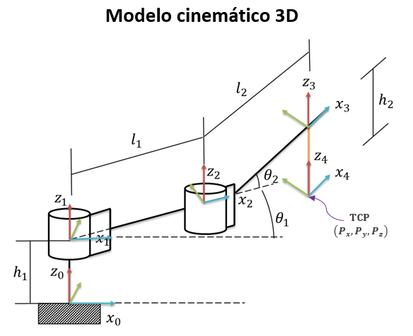
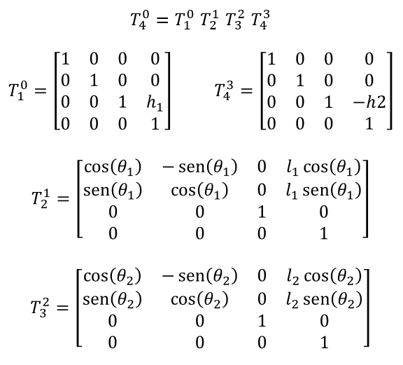
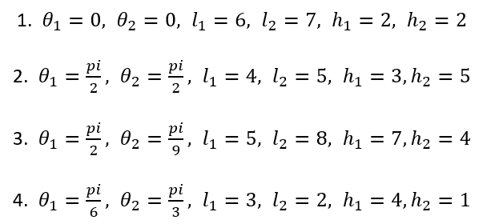

<h1>Aula 4</h1>

Esta clase consiste en realizar una introducción a la cinemática directa.

<h2>Introducción a la cinemática directa</h2>

Consiste en determinar la posición (traslación) y orientación (rotación) del efector final (TCP) con respecto al sistema coordenado de referencia (SC{0}), teniendo en cuenta los movimientos angulares y/o lineales de las articulaciones rotacionales y/o prismáticas, respectivamente.

El problema cinemático directo se reduce a una matriz homogénea de transformación (MTH) donde se relacione la posición y orientación del TCP

<h3>Método geométrico</h3>

1. Conocimientos de geometría espacial y trigonometría

2. Los sistemas coordenados son arbitrarios (no tienen requisitos), pero se debe cumplir con la regla de la mano derecha

3. No es un método sistemático, es decir, para cada robot hay que realizar el análisis.

<h3>Método DH</h3>

1. Utilizado para robots manipuladores seriales

2. Los sistemas coordenados deben ubicarse de acuerdo al movimiento de las articulaciones que están en medio de dos eslabones

3. Es un método sistemático, es decir, el análisis funciona para cualquier robot de configuración serial

<h4>Método geométrico</h4>

Resultado final de la cinemática directa

<h4>MTH</h4>

Resultado final de la cinemática directa

<h3>Ejercicios</h3>

Calcular en Matlab el valor de la matriz de transformación homogénea para el robot planar, con los siguientes valores:

