<h1>Aula 4</h1>

Esta clase consiste en realizar una introducción a la cinemática directa, además, de comprender y aplicar el método DH (Denavit-Hartengerg) como solución de la cinemática directa de robots manipuladores seriales..

<h2>Introducción a la cinemática directa</h2>

Consiste en determinar la posición (traslación) y orientación (rotación) del efector final (TCP) con respecto al sistema coordenado de referencia (SC{0}), teniendo en cuenta los movimientos angulares y/o lineales de las articulaciones rotacionales y/o prismáticas, respectivamente.

El problema cinemático directo se reduce a una matriz homogénea de transformación (MTH) donde se relacione la posición y orientación del TCP

$$𝑇_6^0 = 𝑇_1^0 \cdot 𝑇_2^1 \cdot 𝑇_3^2 \cdot 𝑇_4^3 \cdot 𝑇_5^4 \cdot 𝑇_6^5$$


<h3>Método geométrico</h3>

1. Conocimientos de geometría espacial y trigonometría

2. Los sistemas coordenados son arbitrarios (no tienen requisitos), pero se debe cumplir con la regla de la mano derecha

3. No es un método sistemático, es decir, para cada robot hay que realizar el análisis.

<h3>Método DH</h3>

1. Utilizado para robots manipuladores seriales

2. Los sistemas coordenados deben ubicarse de acuerdo al movimiento de las articulaciones que están en medio de dos eslabones

3. Es un método sistemático, es decir, el análisis funciona para cualquier robot de configuración serial


<h3>Método geométrico</h3>


Traslación (posición)

$$𝑥=𝑙_1cos⁡(𝜃_1)+𝑙_2cos⁡(𝜃_1+𝜃_2)$$

$$𝑦=𝑙_1sen⁡(𝜃_1)+𝑙_2sen⁡(𝜃_1+𝜃_2)$$

$$𝑧=ℎ_1−ℎ_2$$

Rotación (orientación)

$$𝑅_𝑧(𝜃_1)\cdot 𝑅_𝑧(𝜃_2)=𝑅_𝑧(𝜃_2) \cdot 𝑅_𝑧(𝜃_1)=𝑅_𝑧(𝜃_1+𝜃_2)$$

$$𝑅_𝑧(𝜃_1+𝜃_2)=\begin{bmatrix}
cos⁡(𝜃_1+𝜃_2) & -sen⁡(𝜃_1+𝜃_2) & 0\\ 
sen⁡(𝜃_1+𝜃_2) & cos⁡(𝜃_1+𝜃_2) & 0 \\ 
0 & 0 & 1 
\end{bmatrix}$$

```matlab
syms theta1 theta2
RZ1 = simplify(RotarZ(theta1)*RotarZ(theta2))
RZ2 = simplify(RotarZ(theta2)*RotarZ(theta1))
RZ3 = simplify(RotarZ(theta1+theta2))
```

Resultado final de la cinemática directa

$$𝑇_4^0 = \begin{bmatrix}
cos⁡(𝜃_1+𝜃_2) & -sen⁡(𝜃_1+𝜃_2) & 0 & 𝑙_1cos⁡(𝜃_1)+𝑙_2cos⁡(𝜃_1+𝜃_2)\\ 
sen⁡(𝜃_1+𝜃_2) & cos⁡(𝜃_1+𝜃_2) & 0 & 𝑙_1sen⁡(𝜃_1)+𝑙_2sen⁡(𝜃_1+𝜃_2)\\ 
0 & 0 & 1 & ℎ_1−ℎ_2\\ 
0 & 0 & 0 & 1
\end{bmatrix}$$

<h3>Transformaciones</h3>

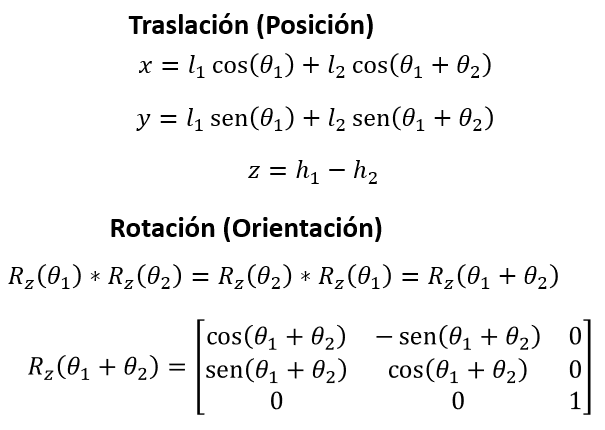

$$𝑇_6^0 = 𝑇_1^0 \cdot 𝑇_2^1 \cdot 𝑇_3^2 \cdot 𝑇_4^3$$

$$𝑇_1^0 = \begin{bmatrix}
1 & 0 & 0 & 0 \\ 
0 & 1 & 0 & 0 \\ 
0 & 0 & 1 & ℎ_1 \\ 
0 & 0 & 0 & 1
\end{bmatrix}$$

$$𝑇_2^1 = \begin{bmatrix}
cos⁡(𝜃_1) & -sen⁡(𝜃_1) & 0 & 𝑙_1cos⁡(𝜃_1)\\ 
sen⁡(𝜃_1) & cos⁡(𝜃_1) & 0 & 𝑙_1sen⁡(𝜃_1)\\ 
0 & 0 & 1 & 0\\ 
0 & 0 & 0 & 1
\end{bmatrix}$$

$$𝑇_3^2 = \begin{bmatrix}
cos⁡(𝜃_2) & -sen⁡(𝜃_2) & 0 & 𝑙_2cos⁡(𝜃_2)\\ 
sen⁡(𝜃_2) & cos⁡(𝜃_2) & 0 & 𝑙_2sen⁡(𝜃_2)\\ 
0 & 0 & 1 & 0\\ 
0 & 0 & 0 & 1
\end{bmatrix}$$

$$𝑇_4^3 = \begin{bmatrix}
1 & 0 & 0 & 0 \\ 
0 & 1 & 0 & 0 \\ 
0 & 0 & 1 & -ℎ_2 \\ 
0 & 0 & 0 & 1
\end{bmatrix}$$

```matlab
%Transformaciones (MTH)

syms h1 h2 theta1 theta2 l1 l2
% theta1 = pi/2
% theta2 = pi/2
% l1 = 5;
% l2 = 5;
% h1 = 3;
% h2 = 2;

T01 = [1 0 0 0;
       0 1 0 0;
       0 0 1 h1;
       0 0 0 1]

T12 = [cos(theta1) -sin(theta1) 0 l1*cos(theta1);
       sin(theta1) cos(theta1)  0 l1*sin(theta1);
       0           0            1 0;
       0           0            0 1]
   
T23 = [cos(theta2) -sin(theta2) 0 l2*cos(theta2);
       sin(theta2) cos(theta2)  0 l2*sin(theta2);
       0           0            1 0;
       0           0            0 1]
   
T34 = [1 0 0 0;
       0 1 0 0;
       0 0 1 -h2;
       0 0 0 1]

T04 = simplify(T01*T12*T23*T34)
% T04 = T01*T12*T23*T34

% r = T04(1:3,1:3)
% m = rad2deg(tr2rpy(r,'zyx'))
```

Resultado final de la cinemática directa

$$𝑇_4^0 = \begin{bmatrix}
cos⁡(𝜃_1+𝜃_2) & -sen⁡(𝜃_1+𝜃_2) & 0 & 𝑙_1cos⁡(𝜃_1)+𝑙_2cos⁡(𝜃_1+𝜃_2)\\ 
sen⁡(𝜃_1+𝜃_2) & cos⁡(𝜃_1+𝜃_2) & 0 & 𝑙_1sen⁡(𝜃_1)+𝑙_2sen⁡(𝜃_1+𝜃_2)\\ 
0 & 0 & 1 & ℎ_1−ℎ_2\\ 
0 & 0 & 0 & 1
\end{bmatrix}$$

<h3>Ejercicios</h3>

Calcular en Matlab el valor de la matriz de transformación homogénea para el robot planar, con los siguientes valores:

$$1. 𝜃_1=0, 𝜃_2=0, 𝑙_1=6, 𝑙_2=7, ℎ_1=2, ℎ_2=2$$

$$2. 𝜃_1=𝜋/2, 𝜃_2=𝜋/2, 𝑙_1=4, 𝑙_2=5, ℎ_1=3, ℎ_2=5$$

$$3. 𝜃_1=𝜋/2, 𝜃_2=𝜋/9, 𝑙_1=5, 𝑙_2=8, ℎ_1=7, ℎ_2=4$$

$$4. 𝜃_1=𝜋/6, 𝜃_2=𝜋/3, 𝑙_1=3, 𝑙_2=2, ℎ_1=4, ℎ_2=1$$

<h2>Método DH</h2>

El método Denavit Hartenberg (DH) fue propuesto en 1955 por Jacques Denavit y Richard S. Hartenberg, el cual consiste en un método matricial que permite establecer de manera sistemática un sistema coordenado final con respecto al sistema coordenado de referencia. Para aplicar el método DH se deben tener en cuenta los siguientes pasos:

1. Asignar el sistema coordenado para cada articulación del robot
2. Determinar los parámetros DH (𝜃,𝑑,𝛼,𝑎), los cuales se utilizarán en el Toolbox Peter Corke de Matlab 
3. Obtener la siguiente matriz:

$$𝑇_𝑛^{𝑛−1}=𝑇𝑟𝑎𝑛𝑠_{𝑧_{𝑛−1}}(𝑑_𝑛) \cdot 𝑅𝑜𝑡_{𝑧_{𝑛−1}}(𝜃_𝑛) \cdot 𝑇𝑟𝑎𝑛𝑠_{𝑥_𝑛}(𝑎_𝑛) \cdot 𝑅𝑜𝑡_{𝑥_𝑛}(𝛼_𝑛)$$

$$𝑇_𝑛^{𝑛−1}= 𝑅𝑜𝑡_{𝑧_{𝑛−1}}(𝜃_𝑛) \cdot 𝑇𝑟𝑎𝑛𝑠_{𝑧_{𝑛−1}}(𝑑_𝑛) \cdot 𝑅𝑜𝑡_{𝑥_𝑛}(𝛼_𝑛) \cdot 𝑇𝑟𝑎𝑛𝑠_{𝑥_𝑛}(𝑎_𝑛)$$

<h3>Paso 1 - Asignación de sistemas coordenados</h3>

Regla 1: El eje Z se debe ubicar de manera positiva en el eje de rotación si la articulación es rotacional o en la misma dirección de movimiento si es prismática.

Regla 2: El eje X debe ser perpendicular al eje Z de su mismo SC y al eje Z del anterior SC.

Regla 3: Todos los sistemas deben respetar la regla de la mano derecha (eje Y).

Regla 4: Cada eje X debe intersecar el eje Z del SC inmediatamente anterior.

<h4>Ejemplo 1</h4>

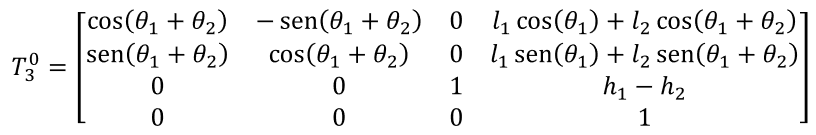

<h4>Ejemplo 2</h4>

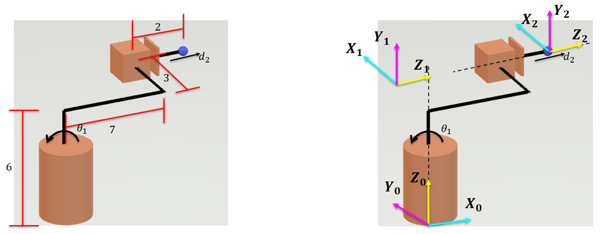

<h4>Ejercicio 1</h4>

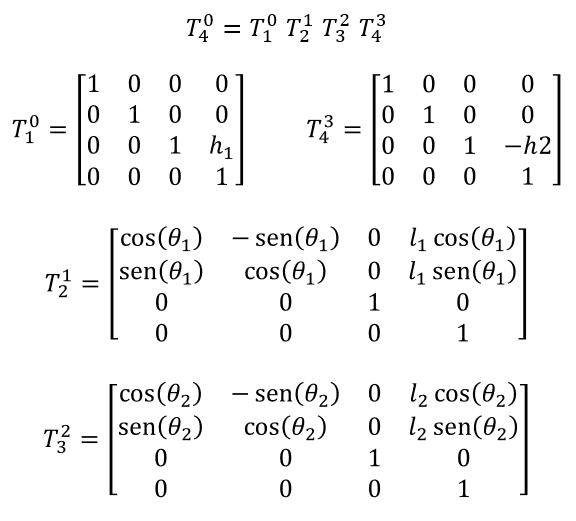

<h4>Ejercicio 2</h4>

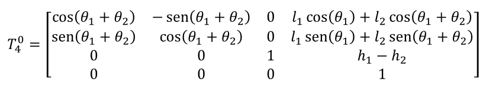

<h3>Paso 2 - Parámetros DH</h3>

Los parámetros DH (𝑑,𝜃,𝑎,𝛼) son definidos por las articulaciones y los eslabones del robot. 

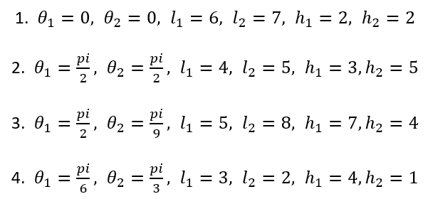

Fuente: Barrientos, A., Peñín, L.F., Balaguer, C., y Aracil, R., 2007, Fundamentos de Robótica, 2nd edition, McGraw-Hill.

<h4>Párametro $𝜃_𝒊$</h4>

Es el ángulo que forman los ejes de $x_{𝑖−1}$ a $x_𝑖$ perpendicular al eje $z_{𝑖−1}$

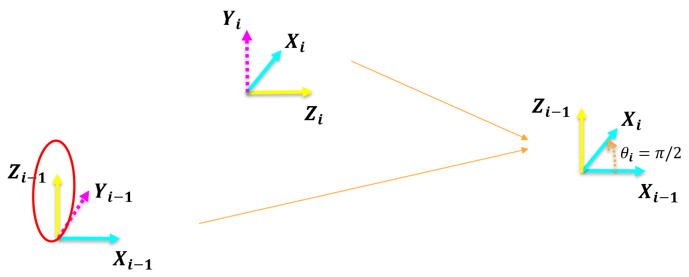

<h4>Párametro $𝒅_𝒊$</h4>

Es la distancia de $𝑋_{𝑖−1}$ a $𝑋_𝑖$ a lo largo del eje $𝑍_{𝑖−1}$

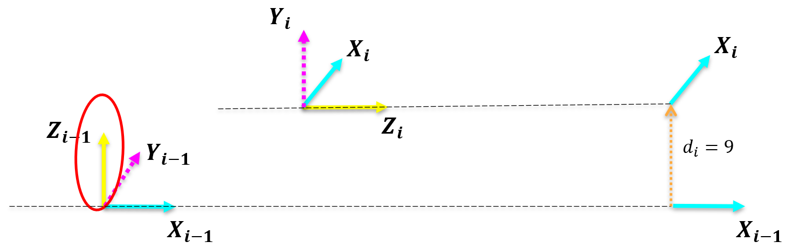

<h4>Párametro $𝜶_𝒊$</h4>

Es el ángulo que forman los ejes de $𝑍_{𝑖−1}$ a $𝑍_𝑖$ perpendicular al eje $𝑋_𝑖$

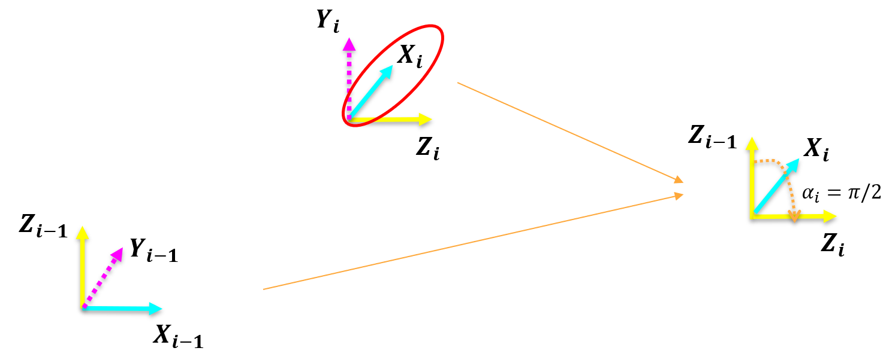

<h4>Párametro $𝒂_𝒊$</h4>

Es la distancia de $𝑍_{𝑖−1}$ a $𝑍_𝑖$ a lo largo del eje $𝑋_𝑖$

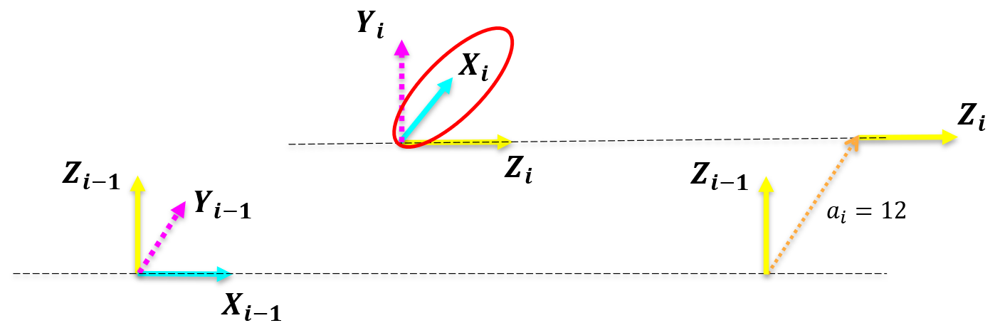

<h4>Ejemplo 1</h4>


```matlab
clear all
close all
clc

%Peter corke
a1 = 12;
a2 = 14;
a3 = 6;
a4 = 4;

q1 = 0;%Theta1
q2 = 0;%Theta2

R(1) = Link('revolute','d',a1,'alpha',pi/2,'a',a2,'offset',0);
R(2) = Link('revolute','d',a3,'alpha',0,'a',a4,'offset',0);

Robot = SerialLink(R,'name','Bender')

Robot.plot([q1,q2],'scale',1.0,'workspace',[-30 30 -30 30 -30 30]);
zlim([-15,30]);
Robot.teach([q1,q2],'rpy/zyx');
MTH = Robot.fkine([q1,q2])
```

<h4>Ejemplo 2</h4>

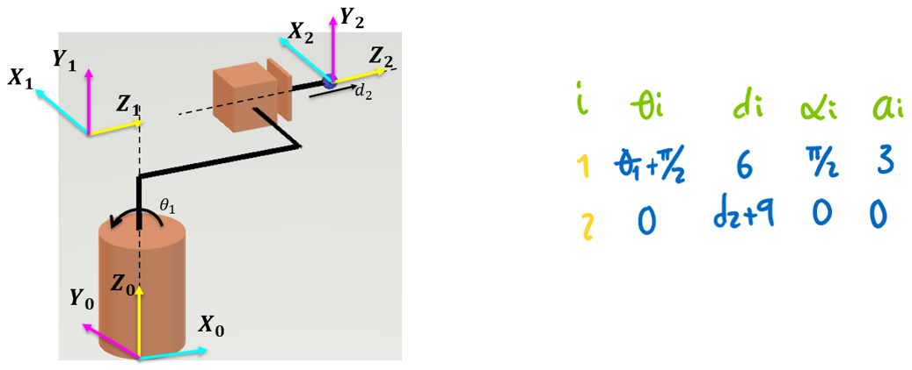

```matlab
clear all
close all
clc

l1 = 6;
l2 = 7;
l3 = 3;
l4 = 2;

q1 = 0;
q2 = 0;

R(1) = Link('revolute','d',l1,'alpha',pi/2,'a',l3,'offset',pi/2);
R(2) = Link('prismatic','theta',0,'alpha',0,'a',0,'offset',l2+l4);
R(2).qlim = [0,10];

Robot = SerialLink(R,'name','Bender')

Robot.plot([q1,q2],'scale',1.0,'workspace',[-30 30 -30 30 -30 30]);
zlim([-15,30]);
Robot.teach([q1,q2],'rpy/zyx');
MTH = Robot.fkine([q1,q2])
```

<h4>Ejercicio 1</h4>

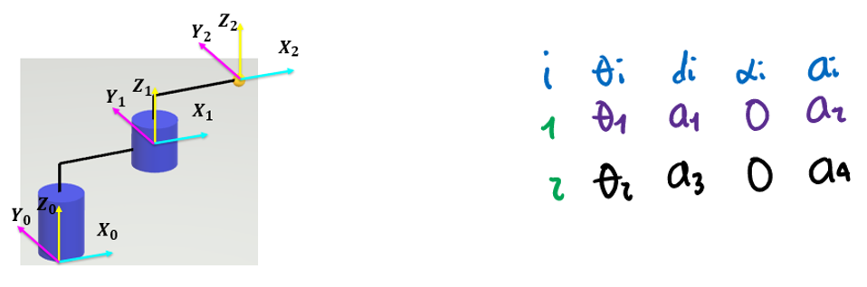

```matlab
clear all
close all
clc

a1 = 10;
a2 = 11;
a3 = 5;
a4 = 12;

q1 = 0;
q2 = 0;

R(1) = Link('revolute','d',a1,'alpha',0,'a',a2,'offset',0);
R(2) = Link('revolute','d',a3,'alpha',0,'a',a4,'offset',0);

Robot = SerialLink(R,'name','Bender')

Robot.plot([q1,q2],'scale',1.0,'workspace',[-30 30 -30 30 -30 30]);
zlim([-15,30]);
Robot.teach([q1,q2],'rpy/zyx');
MTH = Robot.fkine([q1,q2])
```

<h4>Ejercicio 2</h4>


```matlab
clear all
close all
clc

a1 = 15;
a2 = 5;
a3 = 8;
a4 = 5;
a5 = 6;

q1 = 0;
q2 = 0;
q3 = 0;
q4 = 0;

R(1) = Link('revolute','d',a1,'alpha',0,'a',a2,'offset',0);
R(2) = Link('revolute','d',0,'alpha',pi,'a',a3,'offset',0);
R(3) = Link('prismatic','theta',0,'alpha',0,'a',0,'offset',a4);
R(3).qlim = [0,10];
R(4) = Link('revolute','d',a5,'alpha',0,'a',0,'offset',0);

Robot = SerialLink(R,'name','Bender')

Robot.plot([q1,q2,q3,q4],'scale',0.5,'workspace',[-30 30 -30 30 -30 30]);
zlim([-15,30]);
Robot.teach([q1,q2,q3,q4],'rpy/zyx');
MTH = Robot.fkine([q1,q2,q3,q4])
```

<h3>Paso 3 - Matriz DH</h3>

$$𝑇_𝑛^{𝑛−1}=𝑇𝑟𝑎𝑛𝑠_{𝑧_{𝑛−1}}(𝑑_𝑛) \cdot 𝑅𝑜𝑡_{𝑧_{𝑛−1}}(𝜃_𝑛) \cdot 𝑇𝑟𝑎𝑛𝑠_{𝑥_𝑛}(𝑎_𝑛) \cdot 𝑅𝑜𝑡_{𝑥_𝑛}(𝛼_𝑛)$$

$$𝑇_𝑛^{𝑛−1}= 𝑅𝑜𝑡_{𝑧_{𝑛−1}}(𝜃_𝑛) \cdot 𝑇𝑟𝑎𝑛𝑠_{𝑧_{𝑛−1}}(𝑑_𝑛) \cdot 𝑅𝑜𝑡_{𝑥_𝑛}(𝛼_𝑛) \cdot 𝑇𝑟𝑎𝑛𝑠_{𝑥_𝑛}(𝑎_𝑛)$$

<h4>Ejemplo 1</h4>


$$𝑇_1^0 = \begin{bmatrix}
1 & 0 & 0 & 0\\ 
0 & 1 & 0 & 0\\ 
0 & 0 & 1 & 𝑎_1\\ 
0 & 0 & 0 & 1
\end{bmatrix}
\begin{bmatrix}
cos⁡(𝜃_1) & -sen⁡(𝜃_1) & 0 & 0\\ 
sen⁡(𝜃_1) & cos⁡(𝜃_1) & 0 & 0\\ 
0 & 0 & 1 & 0\\ 
0 & 0 & 0 & 1
\end{bmatrix}
\begin{bmatrix}
1 & 0 & 0 & 𝑎_2\\ 
0 & 1 & 0 & 0\\ 
0 & 0 & 1 & 0\\ 
0 & 0 & 0 & 1
\end{bmatrix}
\begin{bmatrix}
1 & 0 & 0 & 0\\ 
0 & cos⁡(𝜋/2) & -sen⁡(𝜋/2) & 0\\ 
0 & sen⁡(𝜋/2) & cos⁡(𝜋/2) & 0\\ 
0 & 0 & 0 & 1
\end{bmatrix}$$

$$𝑇_2^1 = \begin{bmatrix}
1 & 0 & 0 & 0\\ 
0 & 1 & 0 & 0\\ 
0 & 0 & 1 & 𝑎_3\\ 
0 & 0 & 0 & 1
\end{bmatrix}
\begin{bmatrix}
cos⁡(𝜃_2) & -sen⁡(𝜃_2) & 0 & 0\\ 
sen⁡(𝜃_2) & cos⁡(𝜃_2) & 0 & 0\\ 
0 & 0 & 1 & 0\\ 
0 & 0 & 0 & 1
\end{bmatrix}
\begin{bmatrix}
1 & 0 & 0 & 𝑎_4\\ 
0 & 1 & 0 & 0\\ 
0 & 0 & 1 & 0\\ 
0 & 0 & 0 & 1
\end{bmatrix}
\begin{bmatrix}
1 & 0 & 0 & 0\\ 
0 & cos⁡(0) & -sen⁡(0) & 0\\ 
0 & sen⁡(0) & cos⁡(0) & 0\\ 
0 & 0 & 0 & 1
\end{bmatrix}$$

$$𝑇_2^0 = 𝑇_1^0 \cdot 𝑇_2^1 = \begin{bmatrix}
1 & 0 & 0 & 18\\ 
0 & 0 & -1 & -6\\ 
0 & 1 & 0 & 12\\ 
0 & 0 & 0 & 1
\end{bmatrix}$$

```matlab
clear all
close all
clc

%Peter corke
a1 = 12;
a2 = 14;
a3 = 6;
a4 = 4;

q1 = 0;%Theta1
q2 = 0;%Theta2

R(1) = Link('revolute','d',a1,'alpha',pi/2,'a',a2,'offset',0);
R(2) = Link('revolute','d',a3,'alpha',0,'a',a4,'offset',0);

Robot = SerialLink(R,'name','Bender')

Robot.plot([q1,q2],'scale',1.0,'workspace',[-30 30 -30 30 -30 30]);
zlim([-15,30]);
Robot.teach([q1,q2],'rpy/zyx');
MTH = Robot.fkine([q1,q2])

%Matriz (DH)
TZ0 = [1 0 0 0; 0 1 0 0; 0 0 1 a1; 0 0 0 1]
RZ0 = [cos(q1) -sin(q1) 0 0; sin(q1) cos(q1) 0 0; 0 0 1 0; 0 0 0 1]
TX1 = [1 0 0 a2; 0 1 0 0; 0 0 1 0; 0 0 0 1]
RX1 = [1 0 0 0; 0 cos(pi/2) -sin(pi/2) 0; 0 sin(pi/2) cos(pi/2) 0; 0 0 0 1]
T01 =  TZ0*RZ0*TX1*RX1
T01 =  RZ0*TZ0*RX1*TX1

TZ1 = [1 0 0 0; 0 1 0 0; 0 0 1 a3; 0 0 0 1]
RZ1 = [cos(q2) -sin(q2) 0 0; sin(q2) cos(q2) 0 0; 0 0 1 0; 0 0 0 1]
TX2 = [1 0 0 a4; 0 1 0 0; 0 0 1 0; 0 0 0 1]
RX2 = [1 0 0 0; 0 cos(0) -sin(0) 0; 0 sin(0) cos(0) 0; 0 0 0 1]
T12 =  TZ1*RZ1*TX2*RX2
T12 =  RZ1*TZ1*RX2*TX2

T02 = T01*T12

%Confirmar la rotación en ángulos de Euler
m = T02(1:3,1:3)
r = rad2deg(tr2rpy(m,'zyx'))
```

<h4>Ejemplo 2</h4>


$$𝑇_1^0 = \begin{bmatrix}
1 & 0 & 0 & 0\\ 
0 & 1 & 0 & 0\\ 
0 & 0 & 1 & 6\\ 
0 & 0 & 0 & 1
\end{bmatrix}
\begin{bmatrix}
cos⁡(𝜃_1+𝜋/2) & -sen⁡(𝜃_1+𝜋/2) & 0 & 0\\ 
sen⁡(𝜃_1+𝜋/2) & cos⁡(𝜃_1+𝜋/2) & 0 & 0\\ 
0 & 0 & 1 & 0\\ 
0 & 0 & 0 & 1
\end{bmatrix}
\begin{bmatrix}
1 & 0 & 0 & 3\\ 
0 & 1 & 0 & 0\\ 
0 & 0 & 1 & 0\\ 
0 & 0 & 0 & 1
\end{bmatrix}
\begin{bmatrix}
1 & 0 & 0 & 0\\ 
0 & cos⁡(𝜋/2) & -sen⁡(𝜋/2) & 0\\ 
0 & sen⁡(𝜋/2) & cos⁡(𝜋/2) & 0\\ 
0 & 0 & 0 & 1
\end{bmatrix}$$

$$𝑇_2^1 = \begin{bmatrix}
1 & 0 & 0 & 0\\ 
0 & 1 & 0 & 0\\ 
0 & 0 & 1 & 𝑑_2+9\\ 
0 & 0 & 0 & 1
\end{bmatrix}
\begin{bmatrix}
cos⁡(0) & -sen⁡(0) & 0 & 0\\ 
sen⁡(0) & cos⁡(0) & 0 & 0\\ 
0 & 0 & 1 & 0\\ 
0 & 0 & 0 & 1
\end{bmatrix}
\begin{bmatrix}
1 & 0 & 0 & 0\\ 
0 & 1 & 0 & 0\\ 
0 & 0 & 1 & 0\\ 
0 & 0 & 0 & 1
\end{bmatrix}
\begin{bmatrix}
1 & 0 & 0 & 0\\ 
0 & cos⁡(0) & -sen⁡(0) & 0\\ 
0 & sen⁡(0) & cos⁡(0) & 0\\ 
0 & 0 & 0 & 1
\end{bmatrix}$$

$$𝑇_2^0 = 𝑇_1^0 \cdot 𝑇_2^1 = \begin{bmatrix}
0 & 0 & 1 & 9\\ 
1 & 0 & 0 & 3\\ 
0 & 1 & 0 & 6\\ 
0 & 0 & 0 & 1
\end{bmatrix}$$

```matlab
clear all
close all
clc

l1 = 6;
l2 = 7;
l3 = 3;
l4 = 2;

q1 = 0;
q2 = 0;

R(1) = Link('revolute','d',l1,'alpha',pi/2,'a',l3,'offset',pi/2);
R(2) = Link('prismatic','theta',0,'alpha',0,'a',0,'offset',l2+l4);
R(2).qlim = [0,10];

Robot = SerialLink(R,'name','Bender')

Robot.plot([q1,q2],'scale',1.0,'workspace',[-30 30 -30 30 -30 30]);
zlim([-15,30]);
Robot.teach([q1,q2],'rpy/zyx');
MTH = Robot.fkine([q1,q2])

%Matriz (DH)
TZ0 = [1 0 0 0; 0 1 0 0; 0 0 1 l1; 0 0 0 1]
RZ0 = [cos(q1+pi/2) -sin(q1+pi/2) 0 0; sin(q1+pi/2) cos(q1+pi/2) 0 0; 0 0 1 0; 0 0 0 1]
TX1 = [1 0 0 l3; 0 1 0 0; 0 0 1 0; 0 0 0 1]
RX1 = [1 0 0 0; 0 cos(pi/2) -sin(pi/2) 0; 0 sin(pi/2) cos(+pi/2) 0; 0 0 0 1]
T01 =  TZ0*RZ0*TX1*RX1
T01 =  RZ0*TZ0*RX1*TX1

TZ1 = [1 0 0 0; 0 1 0 0; 0 0 1 q2+l2+l4; 0 0 0 1]
RZ1 = [cos(0) -sin(0) 0 0; sin(0) cos(0) 0 0; 0 0 1 0; 0 0 0 1]
TX2 = [1 0 0 0; 0 1 0 0; 0 0 1 0; 0 0 0 1]
RX2 = [1 0 0 0; 0 cos(0) -sin(0) 0; 0 sin(0) cos(0) 0; 0 0 0 1]
T12 =  TZ1*RZ1*TX2*RX2
T12 =  RZ1*TZ1*RX2*TX2

T02 = T01*T12

%Confirmar la rotación en ángulos de Euler
m = T02(1:3,1:3)
r = rad2deg(tr2rpy(m,'zyx'))
```

<h4>Ejercicio 1</h4>


$$𝑇_1^0 = \begin{bmatrix}
1 & 0 & 0 & 0\\ 
0 & 1 & 0 & 0\\ 
0 & 0 & 1 & 𝑎_1\\ 
0 & 0 & 0 & 1
\end{bmatrix}
\begin{bmatrix}
cos⁡(𝜃_1) & -sen⁡(𝜃_1) & 0 & 0\\ 
sen⁡(𝜃_1) & cos⁡(𝜃_1) & 0 & 0\\ 
0 & 0 & 1 & 0\\ 
0 & 0 & 0 & 1
\end{bmatrix}
\begin{bmatrix}
1 & 0 & 0 & 𝑎_2\\ 
0 & 1 & 0 & 0\\ 
0 & 0 & 1 & 0\\ 
0 & 0 & 0 & 1
\end{bmatrix}
\begin{bmatrix}
1 & 0 & 0 & 0\\ 
0 & cos⁡(0) & -sen⁡(0) & 0\\ 
0 & sen⁡(0) & cos⁡(0) & 0\\ 
0 & 0 & 0 & 1
\end{bmatrix}$$

$$𝑇_2^1 = \begin{bmatrix}
1 & 0 & 0 & 0\\ 
0 & 1 & 0 & 0\\ 
0 & 0 & 1 & 𝑎_3\\ 
0 & 0 & 0 & 1
\end{bmatrix}
\begin{bmatrix}
cos⁡(𝜃_2) & -sen⁡(𝜃_2) & 0 & 0\\ 
sen⁡(𝜃_2) & cos⁡(𝜃_2) & 0 & 0\\ 
0 & 0 & 1 & 0\\ 
0 & 0 & 0 & 1
\end{bmatrix}
\begin{bmatrix}
1 & 0 & 0 & 𝑎_4\\ 
0 & 1 & 0 & 0\\ 
0 & 0 & 1 & 0\\ 
0 & 0 & 0 & 1
\end{bmatrix}
\begin{bmatrix}
1 & 0 & 0 & 0\\ 
0 & cos⁡(0) & -sen⁡(0) & 0\\ 
0 & sen⁡(0) & cos⁡(0) & 0\\ 
0 & 0 & 0 & 1
\end{bmatrix}$$

$$𝑇_2^0 = 𝑇_1^0 \cdot 𝑇_2^1 = \begin{bmatrix}
1 & 0 & 0 & 23\\ 
0 & 1 & 0 & 0\\ 
0 & 0 & 1 & 15\\ 
0 & 0 & 0 & 1
\end{bmatrix}$$

```matlab
clear all
close all
clc

a1 = 10;
a2 = 11;
a3 = 5;
a4 = 12;

q1 = 0;
q2 = 0;

R(1) = Link('revolute','d',a1,'alpha',0,'a',a2,'offset',0);
R(2) = Link('revolute','d',a3,'alpha',0,'a',a4,'offset',0);

Robot = SerialLink(R,'name','Bender')

Robot.plot([q1,q2],'scale',1.0,'workspace',[-30 30 -30 30 -30 30]);
zlim([-15,30]);
Robot.teach([q1,q2],'rpy/zyx');
MTH = Robot.fkine([q1,q2])

%Matriz (DH)
TZ0 = [1 0 0 0; 0 1 0 0; 0 0 1 a1; 0 0 0 1]
RZ0 = [cos(q1) -sin(q1) 0 0; sin(q1) cos(q1) 0 0; 0 0 1 0; 0 0 0 1]
TX1 = [1 0 0 a2; 0 1 0 0; 0 0 1 0; 0 0 0 1]
RZ1 = [1 0 0 0; 0 cos(0) -sin(0) 0; 0 sin(0) cos(0) 0; 0 0 0 1]
T01 =  TZ0*RZ0*TX1*RX1
T01 =  RZ0*TZ0*RX1*TX1

TZ1 = [1 0 0 0; 0 1 0 0; 0 0 1 a3; 0 0 0 1]
RZ1 = [cos(q2) -sin(q2) 0 0; sin(q2) cos(q2) 0 0; 0 0 1 0; 0 0 0 1]
TX2 = [1 0 0 a4; 0 1 0 0; 0 0 1 0; 0 0 0 1]
RZ2 = [1 0 0 0; 0 cos(0) -sin(0) 0; 0 sin(0) cos(0) 0; 0 0 0 1]
T12 =  TZ1*RZ1*TX2*RX2
T12 =  RZ1*TZ1*RX2*TX2

T02 = T01*T12

%Confirmar la rotación en ángulos de Euler
m = T02(1:3,1:3)
r = rad2deg(tr2rpy(m,'zyx'))
```

<h4>Ejercicio 2</h4>


$$𝑇_1^0 = \begin{bmatrix}
1 & 0 & 0 & 0\\ 
0 & 1 & 0 & 0\\ 
0 & 0 & 1 & 𝑎_1\\ 
0 & 0 & 0 & 1
\end{bmatrix}
\begin{bmatrix}
cos⁡(𝜃_1) & -sen⁡(𝜃_1) & 0 & 0\\ 
sen⁡(𝜃_1) & cos⁡(𝜃_1) & 0 & 0\\ 
0 & 0 & 1 & 0\\ 
0 & 0 & 0 & 1
\end{bmatrix}
\begin{bmatrix}
1 & 0 & 0 & 𝑎_2\\ 
0 & 1 & 0 & 0\\ 
0 & 0 & 1 & 0\\ 
0 & 0 & 0 & 1
\end{bmatrix}
\begin{bmatrix}
1 & 0 & 0 & 0\\ 
0 & cos⁡(0) & -sen⁡(0) & 0\\ 
0 & sen⁡(0) & cos⁡(0) & 0\\ 
0 & 0 & 0 & 1
\end{bmatrix}$$

$$𝑇_2^1 = \begin{bmatrix}
1 & 0 & 0 & 0\\ 
0 & 1 & 0 & 0\\ 
0 & 0 & 1 & 0\\ 
0 & 0 & 0 & 1
\end{bmatrix}
\begin{bmatrix}
cos⁡(𝜃_2) & -sen⁡(𝜃_2) & 0 & 0\\ 
sen⁡(𝜃_2) & cos⁡(𝜃_2) & 0 & 0\\ 
0 & 0 & 1 & 0\\ 
0 & 0 & 0 & 1
\end{bmatrix}
\begin{bmatrix}
1 & 0 & 0 & 𝑎_3\\ 
0 & 1 & 0 & 0\\ 
0 & 0 & 1 & 0\\ 
0 & 0 & 0 & 1
\end{bmatrix}
\begin{bmatrix}
1 & 0 & 0 & 0\\ 
0 & cos⁡(-𝜋) & -sen⁡(-𝜋) & 0\\ 
0 & sen⁡(-𝜋) & cos⁡(-𝜋) & 0\\ 
0 & 0 & 0 & 1
\end{bmatrix}$$

$$𝑇_3^2 = \begin{bmatrix}
1 & 0 & 0 & 0\\ 
0 & 1 & 0 & 0\\ 
0 & 0 & 1 & 𝑎_4+𝑑_3\\ 
0 & 0 & 0 & 1
\end{bmatrix}
\begin{bmatrix}
cos⁡(0) & -sen⁡(0) & 0 & 0\\ 
sen⁡(0) & cos⁡(0) & 0 & 0\\ 
0 & 0 & 1 & 0\\ 
0 & 0 & 0 & 1
\end{bmatrix}
\begin{bmatrix}
1 & 0 & 0 & 0\\ 
0 & 1 & 0 & 0\\ 
0 & 0 & 1 & 0\\ 
0 & 0 & 0 & 1
\end{bmatrix}
\begin{bmatrix}
1 & 0 & 0 & 0\\ 
0 & cos⁡(0) & -sen⁡(0) & 0\\ 
0 & sen⁡(0) & cos⁡(0) & 0\\ 
0 & 0 & 0 & 1
\end{bmatrix}$$

$$𝑇_4^3 = \begin{bmatrix}
1 & 0 & 0 & 0\\ 
0 & 1 & 0 & 0\\ 
0 & 0 & 1 & 𝑎_5\\ 
0 & 0 & 0 & 1
\end{bmatrix}
\begin{bmatrix}
cos⁡(𝜃_4) & -sen⁡(𝜃_4) & 0 & 0\\ 
sen⁡(𝜃_4) & cos⁡(𝜃_4) & 0 & 0\\ 
0 & 0 & 1 & 0\\ 
0 & 0 & 0 & 1
\end{bmatrix}
\begin{bmatrix}
1 & 0 & 0 & 0\\ 
0 & 1 & 0 & 0\\ 
0 & 0 & 1 & 0\\ 
0 & 0 & 0 & 1
\end{bmatrix}
\begin{bmatrix}
1 & 0 & 0 & 0\\ 
0 & cos⁡(0) & -sen⁡(0) & 0\\ 
0 & sen⁡(0) & cos⁡(0) & 0\\ 
0 & 0 & 0 & 1
\end{bmatrix}$$

$$𝑇_4^0 = 𝑇_1^0 \cdot 𝑇_2^1 \cdot 𝑇_3^2 \cdot 𝑇_4^3 = \begin{bmatrix}
1 & 0 & 0 & 13\\ 
0 & -1 & 0 & 0\\ 
0 & 0 & -1 & 4\\ 
0 & 0 & 0 & 1
\end{bmatrix}$$

```matlab
clear all
close all
clc

a1 = 15;
a2 = 5;
a3 = 8;
a4 = 5;
a5 = 6;

q1 = 0;
q2 = 0;
q3 = 0;
q4 = 0;

R(1) = Link('revolute','d',a1,'alpha',0,'a',a2,'offset',0);
R(2) = Link('revolute','d',0,'alpha',pi,'a',a3,'offset',0);
R(3) = Link('prismatic','theta',0,'alpha',0,'a',0,'offset',a4);
R(3).qlim = [0,10];
R(4) = Link('revolute','d',a5,'alpha',0,'a',0,'offset',0);

Robot = SerialLink(R,'name','Bender')

Robot.plot([q1,q2,q3,q4],'scale',0.5,'workspace',[-30 30 -30 30 -30 30]);
zlim([-15,30]);
Robot.teach([q1,q2,q3,q4],'rpy/zyx');
MTH = Robot.fkine([q1,q2,q3,q4])

%Matriz (DH)
TZ0 = [1 0 0 0; 0 1 0 0; 0 0 1 a1; 0 0 0 1]
RZ0 = [cos(q1) -sin(q1) 0 0; sin(q1) cos(q1) 0 0; 0 0 1 0; 0 0 0 1]
TX1 = [1 0 0 a2; 0 1 0 0; 0 0 1 0; 0 0 0 1]
RZ1 = [1 0 0 0; 0 cos(0) -sin(0) 0; 0 sin(0) cos(0) 0; 0 0 0 1]
T01 =  TZ0*RZ0*TX1*RX1
T01 =  RZ0*TZ0*RX1*TX1

TZ1 = [1 0 0 0; 0 1 0 0; 0 0 1 0; 0 0 0 1]
RZ1 = [cos(q2) -sin(q2) 0 0; sin(q2) cos(q2) 0 0; 0 0 1 0; 0 0 0 1]
TX2 = [1 0 0 a3; 0 1 0 0; 0 0 1 0; 0 0 0 1]
RZ2 = [1 0 0 0; 0 cos(-pi) -sin(-pi) 0; 0 sin(-pi) cos(-pi) 0; 0 0 0 1]
T12 =  TZ1*RZ1*TX2*RX2
T12 =  RZ1*TZ1*RX2*TX2

TZ2 = [1 0 0 0; 0 1 0 0; 0 0 1 a4+q3; 0 0 0 1]
RZ2 = [cos(0) -sin(0) 0 0; sin(0) cos(0) 0 0; 0 0 1 0; 0 0 0 1]
TX3 = [1 0 0 0; 0 1 0 0; 0 0 1 0; 0 0 0 1]
RX3 = [1 0 0 0; 0 cos(0) -sin(0) 0; 0 sin(0) cos(0) 0; 0 0 0 1]
T23 =  TZ2*RZ2*TX3*RX3
T23 =  RZ2*TZ2*RX3*TX3

TZ3 = [1 0 0 0; 0 1 0 0; 0 0 1 a5; 0 0 0 1]
RZ3 = [cos(q4) -sin(q4) 0 0; sin(q4) cos(q4) 0 0; 0 0 1 0; 0 0 0 1]
TX4 = [1 0 0 0; 0 1 0 0; 0 0 1 0; 0 0 0 1]
RX4 = [1 0 0 0; 0 cos(0) -sin(0) 0; 0 sin(0) cos(0) 0; 0 0 0 1]
T34 =  TZ3*RZ3*TX4*RX4
T34 =  RZ3*TZ3*RX4*TX4

T04 = T01*T12*T23*T34

%Confirmar la rotación en ángulos de Euler
m = T04(1:3,1:3)
r = rad2deg(tr2rpy(m,'zyx'))
```

<h4>2R</h4>

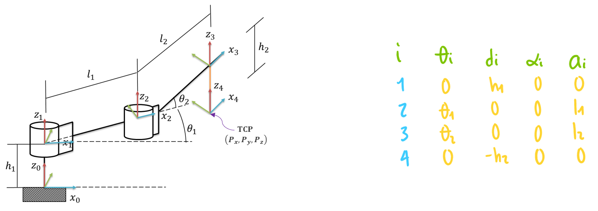

$$𝑇_1^0 = \begin{bmatrix}
1 & 0 & 0 & 0\\ 
0 & 1 & 0 & 0\\ 
0 & 0 & 1 & ℎ_1\\ 
0 & 0 & 0 & 1
\end{bmatrix}
\begin{bmatrix}
cos⁡(0) & -sen⁡(0) & 0 & 0\\ 
sen⁡(0) & cos⁡(0) & 0 & 0\\ 
0 & 0 & 1 & 0\\ 
0 & 0 & 0 & 1
\end{bmatrix}
\begin{bmatrix}
1 & 0 & 0 & 0\\ 
0 & 1 & 0 & 0\\ 
0 & 0 & 1 & 0\\ 
0 & 0 & 0 & 1
\end{bmatrix}
\begin{bmatrix}
1 & 0 & 0 & 0\\ 
0 & cos⁡(0) & -sen⁡(0) & 0\\ 
0 & sen⁡(0) & cos⁡(0) & 0\\ 
0 & 0 & 0 & 1
\end{bmatrix}$$

$$𝑇_2^1 = \begin{bmatrix}
1 & 0 & 0 & 0\\ 
0 & 1 & 0 & 0\\ 
0 & 0 & 1 & 0\\ 
0 & 0 & 0 & 1
\end{bmatrix}
\begin{bmatrix}
cos⁡(𝜃_1) & -sen⁡(𝜃_1) & 0 & 0\\ 
sen⁡(𝜃_1) & cos⁡(𝜃_1) & 0 & 0\\ 
0 & 0 & 1 & 0\\ 
0 & 0 & 0 & 1
\end{bmatrix}
\begin{bmatrix}
1 & 0 & 0 & 𝑙_1\\ 
0 & 1 & 0 & 0\\ 
0 & 0 & 1 & 0\\ 
0 & 0 & 0 & 1
\end{bmatrix}
\begin{bmatrix}
1 & 0 & 0 & 0\\ 
0 & cos⁡(0) & -sen⁡(0) & 0\\ 
0 & sen⁡(0) & cos⁡(0) & 0\\ 
0 & 0 & 0 & 1
\end{bmatrix}$$

$$𝑇_3^2 = \begin{bmatrix}
1 & 0 & 0 & 0\\ 
0 & 1 & 0 & 0\\ 
0 & 0 & 1 & 0\\ 
0 & 0 & 0 & 1
\end{bmatrix}
\begin{bmatrix}
cos⁡(𝜃_2) & -sen⁡(𝜃_2) & 0 & 0\\ 
sen⁡(𝜃_2) & cos⁡(𝜃_2) & 0 & 0\\ 
0 & 0 & 1 & 0\\ 
0 & 0 & 0 & 1
\end{bmatrix}
\begin{bmatrix}
1 & 0 & 0 & 𝑙_2\\ 
0 & 1 & 0 & 0\\ 
0 & 0 & 1 & 0\\ 
0 & 0 & 0 & 1
\end{bmatrix}
\begin{bmatrix}
1 & 0 & 0 & 0\\ 
0 & cos⁡(0) & -sen⁡(0) & 0\\ 
0 & sen⁡(0) & cos⁡(0) & 0\\ 
0 & 0 & 0 & 1
\end{bmatrix}$$

$$𝑇_4^3 = \begin{bmatrix}
1 & 0 & 0 & 0\\ 
0 & 1 & 0 & 0\\ 
0 & 0 & 1 & -ℎ_2\\ 
0 & 0 & 0 & 1
\end{bmatrix}
\begin{bmatrix}
cos⁡(0) & -sen⁡(0) & 0 & 0\\ 
sen⁡(0) & cos⁡(0) & 0 & 0\\ 
0 & 0 & 1 & 0\\ 
0 & 0 & 0 & 1
\end{bmatrix}
\begin{bmatrix}
1 & 0 & 0 & 0\\ 
0 & 1 & 0 & 0\\ 
0 & 0 & 1 & 0\\ 
0 & 0 & 0 & 1
\end{bmatrix}
\begin{bmatrix}
1 & 0 & 0 & 0\\ 
0 & cos⁡(0) & -sen⁡(0) & 0\\ 
0 & sen⁡(0) & cos⁡(0) & 0\\ 
0 & 0 & 0 & 1
\end{bmatrix}$$

$$𝑇_4^0 = 𝑇_1^0 \cdot 𝑇_2^1 \cdot 𝑇_3^2 \cdot 𝑇_4^3 = \begin{bmatrix}
cos⁡(𝜃_1+𝜃_2) & -sen⁡(𝜃_1+𝜃_2) & 0 & 𝑙_1cos⁡(𝜃_1)+𝑙_2cos⁡(𝜃_1+𝜃_2)\\ 
sen⁡(𝜃_1+𝜃_2) & cos⁡(𝜃_1+𝜃_2) & 0 & 𝑙_1sen⁡(𝜃_1)+𝑙_2sen⁡(𝜃_1+𝜃_2)\\ 
0 & 0 & 1 & ℎ_1−ℎ_2\\ 
0 & 0 & 0 & 1
\end{bmatrix}$$

```matlab
clear all
close all
clc

h1 = 0;
h2 = 0;
l1 = 4;
l2 = 4;

q1 = 0;
q2 = 0;

R(1) = Link('revolute','d',0,'alpha',0,'a',l1,'offset',0);
R(2) = Link('revolute','d',0,'alpha',0,'a',l2,'offset',0);

Robot = SerialLink(R,'name','Bender')

Robot.plot([q1,q2],'scale',1,'workspace',[-30 30 -30 30 -30 30]);
zlim([-15,30]);
Robot.teach([q1,q2],'rpy/zyx');
MTH = Robot.fkine([q1,q2])

% syms q1 q2 l1 l2 h1 h2

%Matriz (DH)
TZ0 = [1 0 0 0; 0 1 0 0; 0 0 1 h1; 0 0 0 1]
RZ0 = [cos(0) -sin(0) 0 0; sin(0) cos(0) 0 0; 0 0 1 0; 0 0 0 1]
TX1 = [1 0 0 0; 0 1 0 0; 0 0 1 0; 0 0 0 1]
RX1 = [1 0 0 0; 0 cos(0) -sin(0) 0; 0 sin(0) cos(0) 0; 0 0 0 1]
T01 =  TZ0*RZ0*TX1*RX1
T01 =  RZ0*TZ0*RX1*TX1

TZ1 = [1 0 0 0; 0 1 0 0; 0 0 1 0; 0 0 0 1]
RZ1 = [cos(q1) -sin(q1) 0 0; sin(q1) cos(q1) 0 0; 0 0 1 0; 0 0 0 1]
TX2 = [1 0 0 l1; 0 1 0 0; 0 0 1 0; 0 0 0 1]
RX2 = [1 0 0 0; 0 cos(0) -sin(0) 0; 0 sin(0) cos(0) 0; 0 0 0 1]
T12 =  TZ1*RZ1*TX2*RX2
T12 =  RZ1*TZ1*RX2*TX2

TZ2 = [1 0 0 0; 0 1 0 0; 0 0 1 0; 0 0 0 1]
RZ2 = [cos(q2) -sin(q2) 0 0; sin(q2) cos(q2) 0 0; 0 0 1 0; 0 0 0 1]
TX3 = [1 0 0 l2; 0 1 0 0; 0 0 1 0; 0 0 0 1]
RX3 = [1 0 0 0; 0 cos(0) -sin(0) 0; 0 sin(0) cos(0) 0; 0 0 0 1]
T23 =  TZ2*RZ2*TX3*RX3
T23 =  RZ2*TZ2*RX3*TX3

TZ3 = [1 0 0 0; 0 1 0 0; 0 0 1 -h2; 0 0 0 1]
RZ3 = [cos(0) -sin(0) 0 0; sin(0) cos(0) 0 0; 0 0 1 0; 0 0 0 1]
TX4 = [1 0 0 0; 0 1 0 0; 0 0 1 0; 0 0 0 1]
RX4 = [1 0 0 0; 0 cos(0) -sin(0) 0; 0 sin(0) cos(0) 0; 0 0 0 1]
T34 =  TZ3*RZ3*RX4*TX4
T34 =  RZ3*TZ3*TX4*RX4

% T04 = simplify(T01*T12*T23*T34)
T04 = T01*T12*T23*T34

%Confirmar la rotación en ángulos de Euler
m = T04(1:3,1:3)
r = rad2deg(tr2rpy(m,'zyx'))
```

<h3>Ejercicios</h3>

Realizar la asignación de sistemas coordenados para cada articulación, obtener los parámetros DH y calcular la MTH final de los siguientes cinco tipos de robots: 1. Cartesiano, 2. Cilíndrico, 3. Esférico, 4. Scara y 5. Angular.

