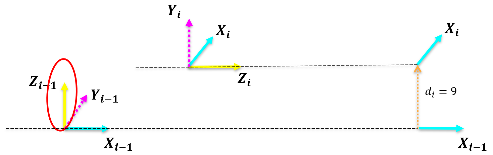
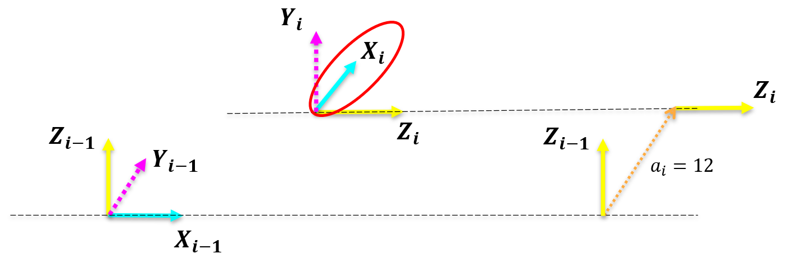
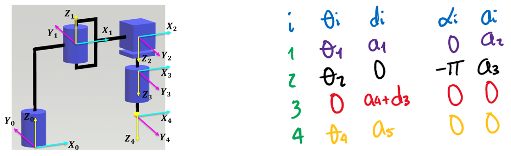
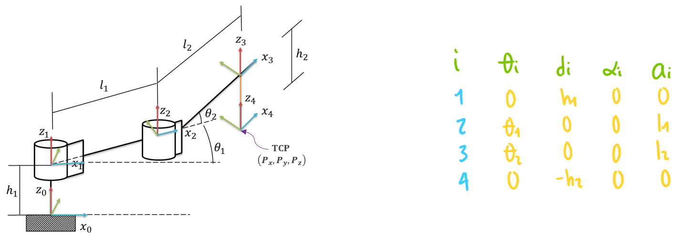
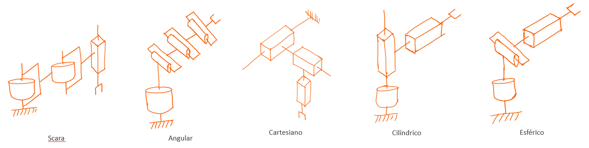

<h1>Aula 5</h1>

Esta clase consiste en comprender y aplicar el método DH (Denavit-Hartengerg) como solución de la cinemática directa de robots manipuladores seriales.

<h2>Método DH</h2>

El método Denavit Hartenberg (DH) fue propuesto en 1955 por Jacques Denavit y Richard S. Hartenberg, el cual consiste en un método matricial que permite establecer de manera sistemática un sistema coordenado final con respecto al sistema coordenado de referencia. Para aplicar el método DH se deben tener en cuenta los siguientes pasos:

1. Asignar el sistema coordenado para cada articulación del robot
2. Determinar los parámetros DH (𝜃,𝑑,𝛼,𝑎), los cuales se utilizarán en el Toolbox Peter Corke de Matlab 
3. Obtener la siguiente matriz :

$$𝑇_𝑛^{𝑛−1}=𝑇𝑟𝑎𝑛𝑠_{𝑧_{𝑛−1}}(𝑑_𝑛) \cdot 𝑅𝑜𝑡_{𝑧_{𝑛−1}}(𝜃_𝑛) \cdot 𝑇𝑟𝑎𝑛𝑠_{𝑥_𝑛}(𝑎_𝑛) \cdot 𝑅𝑜𝑡_{𝑥_𝑛}(𝛼_𝑛)$$

$$𝑇_𝑛^{𝑛−1}= 𝑅𝑜𝑡_{𝑧_{𝑛−1}}(𝜃_𝑛) \cdot 𝑇𝑟𝑎𝑛𝑠_{𝑧_{𝑛−1}}(𝑑_𝑛) \cdot 𝑅𝑜𝑡_{𝑥_𝑛}(𝛼_𝑛) \cdot 𝑇𝑟𝑎𝑛𝑠_{𝑥_𝑛}(𝑎_𝑛)$$

<h3>Asignación de sistemas coordenados</h3>

Regla 1: El eje Z se debe ubicar en el eje de rotación si la articulación es rotacional o en la misma dirección de movimiento si es prismática.

Regla 2: El eje X debe ser perpendicular al eje Z de su mismo SC y al eje Z del anterior SC.

Regla 3: Todos los sistemas deben respetar la regla de la mano derecha (eje Y).

Regla 4: Cada eje X debe intersecar el eje Z del SC inmediatamente anterior.

<h4>Ejemplo 1</h4>


<h4>Ejemplo 2</h4>


<h4>Ejercicio 1</h4>


<h4>Ejercicio 2</h4>


<h3>Parámetros DH</h3>

Los parámetros DH (𝑑,𝜃,𝑎,𝛼) son definidos por las articulaciones y los eslabones del robot. 


Fuente: Barrientos, A., Peñín, L.F., Balaguer, C., y Aracil, R., 2007, Fundamentos de Robótica, 2nd edition, McGraw-Hill.

<h4>Párametro $𝜃_𝒊$</h4>

Es el ángulo que forman los ejes de $x_{𝑖−1}$ a $x_𝑖$ perpendicular al eje $z_{𝑖−1}$


<h4>Párametro $𝒅_𝒊$</h4>

Es la distancia de $𝑋_{𝑖−1}$ a $𝑋_𝑖$ a lo largo del eje $𝑍_{𝑖−1}$



<h4>Párametro $𝜶_𝒊$</h4>

Es el ángulo que forman los ejes de $𝑍_{𝑖−1}$ a $𝑍_𝑖$ perpendicular al eje $𝑋_𝑖$


<h4>Párametro $𝒂_𝒊$</h4>

Es la distancia de $𝑍_{𝑖−1}$ a $𝑍_𝑖$ a lo largo del eje $𝑋_𝑖$



<h4>Ejemplo 1</h4>


```matlab
clear all
close all
clc

%Peter corke
a1 = 12;
a2 = 14;
a3 = 6;
a4 = 4;

q1 = 0;%Theta1
q2 = 0;%Theta2

R(1) = Link('revolute','d',a1,'alpha',pi/2,'a',a2,'offset',0);
R(2) = Link('revolute','d',a3,'alpha',0,'a',a4,'offset',0);

Robot = SerialLink(R,'name','Bender')

Robot.plot([q1,q2],'scale',1.0,'workspace',[-30 30 -30 30 -30 30]);
zlim([-15,30]);
Robot.teach([q1,q2],'rpy/zyx');
MTH = Robot.fkine([q1,q2])
```

<h4>Ejemplo 2</h4>


```matlab
clear all
close all
clc

l1 = 6;
l2 = 7;
l3 = 3;
l4 = 2;

q1 = 0;
q2 = 0;

R(1) = Link('revolute','d',l1,'alpha',pi/2,'a',l3,'offset',pi/2);
R(2) = Link('prismatic','theta',0,'alpha',0,'a',0,'offset',l2+l4);
R(2).qlim = [0,10];

Robot = SerialLink(R,'name','Bender')

Robot.plot([q1,q2],'scale',1.0,'workspace',[-30 30 -30 30 -30 30]);
zlim([-15,30]);
Robot.teach([q1,q2],'rpy/zyx');
MTH = Robot.fkine([q1,q2])
```

<h4>Ejercicio 1</h4>


```matlab
clear all
close all
clc

a1 = 10;
a2 = 11;
a3 = 5;
a4 = 12;

q1 = 0;
q2 = 0;

R(1) = Link('revolute','d',a1,'alpha',0,'a',a2,'offset',0);
R(2) = Link('revolute','d',a3,'alpha',0,'a',a4,'offset',0);

Robot = SerialLink(R,'name','Bender')

Robot.plot([q1,q2],'scale',1.0,'workspace',[-30 30 -30 30 -30 30]);
zlim([-15,30]);
Robot.teach([q1,q2],'rpy/zyx');
MTH = Robot.fkine([q1,q2])
```

<h4>Ejercicio 2</h4>



```matlab
clear all
close all
clc

a1 = 15;
a2 = 5;
a3 = 8;
a4 = 5;
a5 = 6;

q1 = 0;
q2 = 0;
q3 = 0;
q4 = 0;

R(1) = Link('revolute','d',a1,'alpha',0,'a',a2,'offset',0);
R(2) = Link('revolute','d',0,'alpha',pi,'a',a3,'offset',0);
R(3) = Link('prismatic','theta',0,'alpha',0,'a',0,'offset',a4);
R(3).qlim = [0,10];
R(4) = Link('revolute','d',a5,'alpha',0,'a',0,'offset',0);

Robot = SerialLink(R,'name','Bender')

Robot.plot([q1,q2,q3,q4],'scale',0.5,'workspace',[-30 30 -30 30 -30 30]);
zlim([-15,30]);
Robot.teach([q1,q2,q3,q4],'rpy/zyx');
MTH = Robot.fkine([q1,q2,q3,q4])
```

<h3>Matriz DH</h3>

$$𝑇_𝑛^{𝑛−1}=𝑇𝑟𝑎𝑛𝑠_{𝑧_{𝑛−1}}(𝑑_𝑛) \cdot 𝑅𝑜𝑡_{𝑧_{𝑛−1}}(𝜃_𝑛) \cdot 𝑇𝑟𝑎𝑛𝑠_{𝑥_𝑛}(𝑎_𝑛) \cdot 𝑅𝑜𝑡_{𝑥_𝑛}(𝛼_𝑛)$$

$$𝑇_𝑛^{𝑛−1}= 𝑅𝑜𝑡_{𝑧_{𝑛−1}}(𝜃_𝑛) \cdot 𝑇𝑟𝑎𝑛𝑠_{𝑧_{𝑛−1}}(𝑑_𝑛) \cdot 𝑅𝑜𝑡_{𝑥_𝑛}(𝛼_𝑛) \cdot 𝑇𝑟𝑎𝑛𝑠_{𝑥_𝑛}(𝑎_𝑛)$$

<h4>Ejemplo 1</h4>


$$𝑇_1^0 = \begin{bmatrix}
1 & 0 & 0 & 0\\ 
0 & 1 & 0 & 0\\ 
0 & 0 & 1 & 𝑎_1\\ 
0 & 0 & 0 & 1
\end{bmatrix}
\begin{bmatrix}
cos⁡(𝜃_1) & -sen⁡(𝜃_1) & 0 & 0\\ 
sen⁡(𝜃_1) & cos⁡(𝜃_1) & 0 & 0\\ 
0 & 0 & 1 & 0\\ 
0 & 0 & 0 & 1
\end{bmatrix}
\begin{bmatrix}
1 & 0 & 0 & 𝑎_2\\ 
0 & 1 & 0 & 0\\ 
0 & 0 & 1 & 0\\ 
0 & 0 & 0 & 1
\end{bmatrix}
\begin{bmatrix}
1 & 0 & 0 & 0\\ 
0 & cos⁡(𝜋/2) & -sen⁡(𝜋/2) & 0\\ 
0 & sen⁡(𝜋/2) & cos⁡(𝜋/2) & 0\\ 
0 & 0 & 0 & 1
\end{bmatrix}$$

$$𝑇_2^1 = \begin{bmatrix}
1 & 0 & 0 & 0\\ 
0 & 1 & 0 & 0\\ 
0 & 0 & 1 & 𝑎_3\\ 
0 & 0 & 0 & 1
\end{bmatrix}
\begin{bmatrix}
cos⁡(𝜃_2) & -sen⁡(𝜃_2) & 0 & 0\\ 
sen⁡(𝜃_2) & cos⁡(𝜃_2) & 0 & 0\\ 
0 & 0 & 1 & 0\\ 
0 & 0 & 0 & 1
\end{bmatrix}
\begin{bmatrix}
1 & 0 & 0 & 𝑎_4\\ 
0 & 1 & 0 & 0\\ 
0 & 0 & 1 & 0\\ 
0 & 0 & 0 & 1
\end{bmatrix}
\begin{bmatrix}
1 & 0 & 0 & 0\\ 
0 & cos⁡(0) & -sen⁡(0) & 0\\ 
0 & sen⁡(0) & cos⁡(0) & 0\\ 
0 & 0 & 0 & 1
\end{bmatrix}$$

$$𝑇_2^0 = 𝑇_1^0 \cdot 𝑇_2^1 = \begin{bmatrix}
1 & 0 & 0 & 18\\ 
0 & 0 & -1 & -6\\ 
0 & 1 & 0 & 12\\ 
0 & 0 & 0 & 1
\end{bmatrix}$$

```matlab
clear all
close all
clc

%Peter corke
a1 = 12;
a2 = 14;
a3 = 6;
a4 = 4;

q1 = 0;%Theta1
q2 = 0;%Theta2

R(1) = Link('revolute','d',a1,'alpha',pi/2,'a',a2,'offset',0);
R(2) = Link('revolute','d',a3,'alpha',0,'a',a4,'offset',0);

Robot = SerialLink(R,'name','Bender')

Robot.plot([q1,q2],'scale',1.0,'workspace',[-30 30 -30 30 -30 30]);
zlim([-15,30]);
Robot.teach([q1,q2],'rpy/zyx');
MTH = Robot.fkine([q1,q2])

%Matriz (DH)
TZ0 = [1 0 0 0; 0 1 0 0; 0 0 1 a1; 0 0 0 1]
RZ0 = [cos(q1) -sin(q1) 0 0; sin(q1) cos(q1) 0 0; 0 0 1 0; 0 0 0 1]
TX1 = [1 0 0 a2; 0 1 0 0; 0 0 1 0; 0 0 0 1]
RZ1 = [1 0 0 0; 0 cos(pi/2) -sin(pi/2) 0; 0 sin(pi/2) cos(pi/2) 0; 0 0 0 1]
T01 =  TZ0*RZ0*TX1*RZ1
T01 =  RZ0*TZ0*TX1*RZ1

TZ1 = [1 0 0 0; 0 1 0 0; 0 0 1 a3; 0 0 0 1]
RZ1 = [cos(q2) -sin(q2) 0 0; sin(q2) cos(q2) 0 0; 0 0 1 0; 0 0 0 1]
TX2 = [1 0 0 a4; 0 1 0 0; 0 0 1 0; 0 0 0 1]
RZ2 = [1 0 0 0; 0 cos(0) -sin(0) 0; 0 sin(0) cos(0) 0; 0 0 0 1]
% T12 =  TZ1*RZ1*TX2*RZ2
T12 =  RZ1*TZ1*TX2*RZ2

T02 = T01*T12

%Confirmar la rotación en ángulos de Euler
m = T02(1:3,1:3)
r = rad2deg(tr2rpy(m,'zyx'))
```

<h4>Ejemplo 2</h4>


$$𝑇_1^0 = \begin{bmatrix}
1 & 0 & 0 & 0\\ 
0 & 1 & 0 & 0\\ 
0 & 0 & 1 & 6\\ 
0 & 0 & 0 & 1
\end{bmatrix}
\begin{bmatrix}
cos⁡(𝜃_1+𝜋/2) & -sen⁡(𝜃_1+𝜋/2) & 0 & 0\\ 
sen⁡(𝜃_1+𝜋/2) & cos⁡(𝜃_1+𝜋/2) & 0 & 0\\ 
0 & 0 & 1 & 0\\ 
0 & 0 & 0 & 1
\end{bmatrix}
\begin{bmatrix}
1 & 0 & 0 & 3\\ 
0 & 1 & 0 & 0\\ 
0 & 0 & 1 & 0\\ 
0 & 0 & 0 & 1
\end{bmatrix}
\begin{bmatrix}
1 & 0 & 0 & 0\\ 
0 & cos⁡(𝜋/2) & -sen⁡(𝜋/2) & 0\\ 
0 & sen⁡(𝜋/2) & cos⁡(𝜋/2) & 0\\ 
0 & 0 & 0 & 1
\end{bmatrix}$$

$$𝑇_2^1 = \begin{bmatrix}
1 & 0 & 0 & 0\\ 
0 & 1 & 0 & 0\\ 
0 & 0 & 1 & 𝑑_2+9\\ 
0 & 0 & 0 & 1
\end{bmatrix}
\begin{bmatrix}
cos⁡(0) & -sen⁡(0) & 0 & 0\\ 
sen⁡(0) & cos⁡(0) & 0 & 0\\ 
0 & 0 & 1 & 0\\ 
0 & 0 & 0 & 1
\end{bmatrix}
\begin{bmatrix}
1 & 0 & 0 & 0\\ 
0 & 1 & 0 & 0\\ 
0 & 0 & 1 & 0\\ 
0 & 0 & 0 & 1
\end{bmatrix}
\begin{bmatrix}
1 & 0 & 0 & 0\\ 
0 & cos⁡(0) & -sen⁡(0) & 0\\ 
0 & sen⁡(0) & cos⁡(0) & 0\\ 
0 & 0 & 0 & 1
\end{bmatrix}$$

$$𝑇_2^0 = 𝑇_1^0 \cdot 𝑇_2^1 = \begin{bmatrix}
0 & 0 & 1 & 9\\ 
1 & 0 & 0 & 3\\ 
0 & 1 & 0 & 6\\ 
0 & 0 & 0 & 1
\end{bmatrix}$$

```matlab
clear all
close all
clc

l1 = 6;
l2 = 7;
l3 = 3;
l4 = 2;

q1 = 0;
q2 = 0;

R(1) = Link('revolute','d',l1,'alpha',pi/2,'a',l3,'offset',pi/2);
R(2) = Link('prismatic','theta',0,'alpha',0,'a',0,'offset',l2+l4);
R(2).qlim = [0,10];

Robot = SerialLink(R,'name','Bender')

Robot.plot([q1,q2],'scale',1.0,'workspace',[-30 30 -30 30 -30 30]);
zlim([-15,30]);
Robot.teach([q1,q2],'rpy/zyx');
MTH = Robot.fkine([q1,q2])

%Matriz (DH)
TZ0 = [1 0 0 0; 0 1 0 0; 0 0 1 l1; 0 0 0 1]
RZ0 = [cos(q1+pi/2) -sin(q1+pi/2) 0 0; sin(q1+pi/2) cos(q1+pi/2) 0 0; 0 0 1 0; 0 0 0 1]
TX1 = [1 0 0 l3; 0 1 0 0; 0 0 1 0; 0 0 0 1]
RZ1 = [1 0 0 0; 0 cos(pi/2) -sin(pi/2) 0; 0 sin(pi/2) cos(+pi/2) 0; 0 0 0 1]
% T01 =  TZ0*RZ0*TX1*RZ1
T01 =  RZ0*TZ0*TX1*RZ1

TZ1 = [1 0 0 0; 0 1 0 0; 0 0 1 q2+l2+l4; 0 0 0 1]
RZ1 = [cos(0) -sin(0) 0 0; sin(0) cos(0) 0 0; 0 0 1 0; 0 0 0 1]
TX2 = [1 0 0 0; 0 1 0 0; 0 0 1 0; 0 0 0 1]
RZ2 = [1 0 0 0; 0 cos(0) -sin(0) 0; 0 sin(0) cos(0) 0; 0 0 0 1]
% T12 =  TZ1*RZ1*TX2*RZ2
T12 =  RZ1*TZ1*TX2*RZ2

T02 = T01*T12

%Confirmar la rotación en ángulos de Euler
m = T02(1:3,1:3)
r = rad2deg(tr2rpy(m,'zyx'))
```

<h4>Ejercicio 1</h4>


$$𝑇_1^0 = \begin{bmatrix}
1 & 0 & 0 & 0\\ 
0 & 1 & 0 & 0\\ 
0 & 0 & 1 & 𝑎_1\\ 
0 & 0 & 0 & 1
\end{bmatrix}
\begin{bmatrix}
cos⁡(𝜃_1) & -sen⁡(𝜃_1) & 0 & 0\\ 
sen⁡(𝜃_1) & cos⁡(𝜃_1) & 0 & 0\\ 
0 & 0 & 1 & 0\\ 
0 & 0 & 0 & 1
\end{bmatrix}
\begin{bmatrix}
1 & 0 & 0 & 𝑎_2\\ 
0 & 1 & 0 & 0\\ 
0 & 0 & 1 & 0\\ 
0 & 0 & 0 & 1
\end{bmatrix}
\begin{bmatrix}
1 & 0 & 0 & 0\\ 
0 & cos⁡(0) & -sen⁡(0) & 0\\ 
0 & sen⁡(0) & cos⁡(0) & 0\\ 
0 & 0 & 0 & 1
\end{bmatrix}$$

$$𝑇_2^1 = \begin{bmatrix}
1 & 0 & 0 & 0\\ 
0 & 1 & 0 & 0\\ 
0 & 0 & 1 & 𝑎_3\\ 
0 & 0 & 0 & 1
\end{bmatrix}
\begin{bmatrix}
cos⁡(𝜃_2) & -sen⁡(𝜃_2) & 0 & 0\\ 
sen⁡(𝜃_2) & cos⁡(𝜃_2) & 0 & 0\\ 
0 & 0 & 1 & 0\\ 
0 & 0 & 0 & 1
\end{bmatrix}
\begin{bmatrix}
1 & 0 & 0 & 𝑎_4\\ 
0 & 1 & 0 & 0\\ 
0 & 0 & 1 & 0\\ 
0 & 0 & 0 & 1
\end{bmatrix}
\begin{bmatrix}
1 & 0 & 0 & 0\\ 
0 & cos⁡(0) & -sen⁡(0) & 0\\ 
0 & sen⁡(0) & cos⁡(0) & 0\\ 
0 & 0 & 0 & 1
\end{bmatrix}$$

$$𝑇_2^0 = 𝑇_1^0 \cdot 𝑇_2^1 = \begin{bmatrix}
1 & 0 & 0 & 23\\ 
0 & 1 & 0 & 0\\ 
0 & 0 & 1 & 15\\ 
0 & 0 & 0 & 1
\end{bmatrix}$$

```matlab
clear all
close all
clc

a1 = 10;
a2 = 11;
a3 = 5;
a4 = 12;

q1 = 0;
q2 = 0;

R(1) = Link('revolute','d',a1,'alpha',0,'a',a2,'offset',0);
R(2) = Link('revolute','d',a3,'alpha',0,'a',a4,'offset',0);

Robot = SerialLink(R,'name','Bender')

Robot.plot([q1,q2],'scale',1.0,'workspace',[-30 30 -30 30 -30 30]);
zlim([-15,30]);
Robot.teach([q1,q2],'rpy/zyx');
MTH = Robot.fkine([q1,q2])

%Matriz (DH)
TZ0 = [1 0 0 0; 0 1 0 0; 0 0 1 a1; 0 0 0 1]
RZ0 = [cos(q1) -sin(q1) 0 0; sin(q1) cos(q1) 0 0; 0 0 1 0; 0 0 0 1]
TX1 = [1 0 0 a2; 0 1 0 0; 0 0 1 0; 0 0 0 1]
RZ1 = [1 0 0 0; 0 cos(0) -sin(0) 0; 0 sin(0) cos(0) 0; 0 0 0 1]
% T01 =  TZ0*RZ0*TX1*RZ1
T01 =  RZ0*TZ0*TX1*RZ1

TZ1 = [1 0 0 0; 0 1 0 0; 0 0 1 a3; 0 0 0 1]
RZ1 = [cos(q2) -sin(q2) 0 0; sin(q2) cos(q2) 0 0; 0 0 1 0; 0 0 0 1]
TX2 = [1 0 0 a4; 0 1 0 0; 0 0 1 0; 0 0 0 1]
RZ2 = [1 0 0 0; 0 cos(0) -sin(0) 0; 0 sin(0) cos(0) 0; 0 0 0 1]
% T12 =  TZ1*RZ1*TX2*RZ2
T12 =  RZ1*TZ1*TX2*RZ2

T02 = T01*T12

%Confirmar la rotación en ángulos de Euler
m = T02(1:3,1:3)
r = rad2deg(tr2rpy(m,'zyx'))
```

<h4>Ejercicio 2</h4>


$$𝑇_1^0 = \begin{bmatrix}
1 & 0 & 0 & 0\\ 
0 & 1 & 0 & 0\\ 
0 & 0 & 1 & 𝑎_1\\ 
0 & 0 & 0 & 1
\end{bmatrix}
\begin{bmatrix}
cos⁡(𝜃_1) & -sen⁡(𝜃_1) & 0 & 0\\ 
sen⁡(𝜃_1) & cos⁡(𝜃_1) & 0 & 0\\ 
0 & 0 & 1 & 0\\ 
0 & 0 & 0 & 1
\end{bmatrix}
\begin{bmatrix}
1 & 0 & 0 & 𝑎_2\\ 
0 & 1 & 0 & 0\\ 
0 & 0 & 1 & 0\\ 
0 & 0 & 0 & 1
\end{bmatrix}
\begin{bmatrix}
1 & 0 & 0 & 0\\ 
0 & cos⁡(0) & -sen⁡(0) & 0\\ 
0 & sen⁡(0) & cos⁡(0) & 0\\ 
0 & 0 & 0 & 1
\end{bmatrix}$$

$$𝑇_2^1 = \begin{bmatrix}
1 & 0 & 0 & 0\\ 
0 & 1 & 0 & 0\\ 
0 & 0 & 1 & 0\\ 
0 & 0 & 0 & 1
\end{bmatrix}
\begin{bmatrix}
cos⁡(𝜃_2) & -sen⁡(𝜃_2) & 0 & 0\\ 
sen⁡(𝜃_2) & cos⁡(𝜃_2) & 0 & 0\\ 
0 & 0 & 1 & 0\\ 
0 & 0 & 0 & 1
\end{bmatrix}
\begin{bmatrix}
1 & 0 & 0 & 𝑎_3\\ 
0 & 1 & 0 & 0\\ 
0 & 0 & 1 & 0\\ 
0 & 0 & 0 & 1
\end{bmatrix}
\begin{bmatrix}
1 & 0 & 0 & 0\\ 
0 & cos⁡(-𝜋) & -sen⁡(-𝜋) & 0\\ 
0 & sen⁡(-𝜋) & cos⁡(-𝜋) & 0\\ 
0 & 0 & 0 & 1
\end{bmatrix}$$

$$𝑇_3^2 = \begin{bmatrix}
1 & 0 & 0 & 0\\ 
0 & 1 & 0 & 0\\ 
0 & 0 & 1 & 𝑎_4+𝑑_3\\ 
0 & 0 & 0 & 1
\end{bmatrix}
\begin{bmatrix}
cos⁡(0) & -sen⁡(0) & 0 & 0\\ 
sen⁡(0) & cos⁡(0) & 0 & 0\\ 
0 & 0 & 1 & 0\\ 
0 & 0 & 0 & 1
\end{bmatrix}
\begin{bmatrix}
1 & 0 & 0 & 0\\ 
0 & 1 & 0 & 0\\ 
0 & 0 & 1 & 0\\ 
0 & 0 & 0 & 1
\end{bmatrix}
\begin{bmatrix}
1 & 0 & 0 & 0\\ 
0 & cos⁡(0) & -sen⁡(0) & 0\\ 
0 & sen⁡(0) & cos⁡(0) & 0\\ 
0 & 0 & 0 & 1
\end{bmatrix}$$

$$𝑇_4^3 = \begin{bmatrix}
1 & 0 & 0 & 0\\ 
0 & 1 & 0 & 0\\ 
0 & 0 & 1 & 𝑎_5\\ 
0 & 0 & 0 & 1
\end{bmatrix}
\begin{bmatrix}
cos⁡(𝜃_4) & -sen⁡(𝜃_4) & 0 & 0\\ 
sen⁡(𝜃_4) & cos⁡(𝜃_4) & 0 & 0\\ 
0 & 0 & 1 & 0\\ 
0 & 0 & 0 & 1
\end{bmatrix}
\begin{bmatrix}
1 & 0 & 0 & 0\\ 
0 & 1 & 0 & 0\\ 
0 & 0 & 1 & 0\\ 
0 & 0 & 0 & 1
\end{bmatrix}
\begin{bmatrix}
1 & 0 & 0 & 0\\ 
0 & cos⁡(0) & -sen⁡(0) & 0\\ 
0 & sen⁡(0) & cos⁡(0) & 0\\ 
0 & 0 & 0 & 1
\end{bmatrix}$$

$$𝑇_4^0 = 𝑇_1^0 \cdot 𝑇_2^1 \cdot 𝑇_3^2 \cdot 𝑇_4^3 = \begin{bmatrix}
1 & 0 & 0 & 13\\ 
0 & -1 & 0 & 0\\ 
0 & 0 & -1 & 4\\ 
0 & 0 & 0 & 1
\end{bmatrix}$$

```matlab
clear all
close all
clc

a1 = 15;
a2 = 5;
a3 = 8;
a4 = 5;
a5 = 6;

q1 = 0;
q2 = 0;
q3 = 0;
q4 = 0;

R(1) = Link('revolute','d',a1,'alpha',0,'a',a2,'offset',0);
R(2) = Link('revolute','d',0,'alpha',pi,'a',a3,'offset',0);
R(3) = Link('prismatic','theta',0,'alpha',0,'a',0,'offset',a4);
R(3).qlim = [0,10];
R(4) = Link('revolute','d',a5,'alpha',0,'a',0,'offset',0);

Robot = SerialLink(R,'name','Bender')

Robot.plot([q1,q2,q3,q4],'scale',0.5,'workspace',[-30 30 -30 30 -30 30]);
zlim([-15,30]);
Robot.teach([q1,q2,q3,q4],'rpy/zyx');
MTH = Robot.fkine([q1,q2,q3,q4])

%Matriz (DH)
TZ0 = [1 0 0 0; 0 1 0 0; 0 0 1 a1; 0 0 0 1]
RZ0 = [cos(q1) -sin(q1) 0 0; sin(q1) cos(q1) 0 0; 0 0 1 0; 0 0 0 1]
TX1 = [1 0 0 a2; 0 1 0 0; 0 0 1 0; 0 0 0 1]
RZ1 = [1 0 0 0; 0 cos(0) -sin(0) 0; 0 sin(0) cos(0) 0; 0 0 0 1]
% T01 =  TZ0*RZ0*TX1*RZ1
T01 =  RZ0*TZ0*TX1*RZ1

TZ1 = [1 0 0 0; 0 1 0 0; 0 0 1 0; 0 0 0 1]
RZ1 = [cos(q2) -sin(q2) 0 0; sin(q2) cos(q2) 0 0; 0 0 1 0; 0 0 0 1]
TX2 = [1 0 0 a3; 0 1 0 0; 0 0 1 0; 0 0 0 1]
RZ2 = [1 0 0 0; 0 cos(-pi) -sin(-pi) 0; 0 sin(-pi) cos(-pi) 0; 0 0 0 1]
% T12 =  TZ1*RZ1*TX2*RZ2
T12 =  RZ1*TZ1*TX2*RZ2

TZ2 = [1 0 0 0; 0 1 0 0; 0 0 1 a4+q3; 0 0 0 1]
RZ2 = [cos(0) -sin(0) 0 0; sin(0) cos(0) 0 0; 0 0 1 0; 0 0 0 1]
TX3 = [1 0 0 0; 0 1 0 0; 0 0 1 0; 0 0 0 1]
RZ3 = [1 0 0 0; 0 cos(0) -sin(0) 0; 0 sin(0) cos(0) 0; 0 0 0 1]
% T01 =  TZ0*RZ0*TX1*RZ1
T23 =  RZ2*TZ2*TX3*RZ3

TZ3 = [1 0 0 0; 0 1 0 0; 0 0 1 a5; 0 0 0 1]
RZ3 = [cos(q4) -sin(q4) 0 0; sin(q4) cos(q4) 0 0; 0 0 1 0; 0 0 0 1]
TX4 = [1 0 0 0; 0 1 0 0; 0 0 1 0; 0 0 0 1]
RZ4 = [1 0 0 0; 0 cos(0) -sin(0) 0; 0 sin(0) cos(0) 0; 0 0 0 1]
% T12 =  TZ1*RZ1*TX2*RZ2
T34 =  RZ3*TZ3*TX4*RZ4

T04 = T01*T12*T23*T34

%Confirmar la rotación en ángulos de Euler
m = T04(1:3,1:3)
r = rad2deg(tr2rpy(m,'zyx'))
```

<h4>2R</h4>



$$𝑇_1^0 = \begin{bmatrix}
1 & 0 & 0 & 0\\ 
0 & 1 & 0 & 0\\ 
0 & 0 & 1 & ℎ_1\\ 
0 & 0 & 0 & 1
\end{bmatrix}
\begin{bmatrix}
cos⁡(0) & -sen⁡(0) & 0 & 0\\ 
sen⁡(0) & cos⁡(0) & 0 & 0\\ 
0 & 0 & 1 & 0\\ 
0 & 0 & 0 & 1
\end{bmatrix}
\begin{bmatrix}
1 & 0 & 0 & 0\\ 
0 & 1 & 0 & 0\\ 
0 & 0 & 1 & 0\\ 
0 & 0 & 0 & 1
\end{bmatrix}
\begin{bmatrix}
1 & 0 & 0 & 0\\ 
0 & cos⁡(0) & -sen⁡(0) & 0\\ 
0 & sen⁡(0) & cos⁡(0) & 0\\ 
0 & 0 & 0 & 1
\end{bmatrix}$$

$$𝑇_2^1 = \begin{bmatrix}
1 & 0 & 0 & 0\\ 
0 & 1 & 0 & 0\\ 
0 & 0 & 1 & 0\\ 
0 & 0 & 0 & 1
\end{bmatrix}
\begin{bmatrix}
cos⁡(𝜃_1) & -sen⁡(𝜃_1) & 0 & 0\\ 
sen⁡(𝜃_1) & cos⁡(𝜃_1) & 0 & 0\\ 
0 & 0 & 1 & 0\\ 
0 & 0 & 0 & 1
\end{bmatrix}
\begin{bmatrix}
1 & 0 & 0 & 𝑙_1\\ 
0 & 1 & 0 & 0\\ 
0 & 0 & 1 & 0\\ 
0 & 0 & 0 & 1
\end{bmatrix}
\begin{bmatrix}
1 & 0 & 0 & 0\\ 
0 & cos⁡(0) & -sen⁡(0) & 0\\ 
0 & sen⁡(0) & cos⁡(0) & 0\\ 
0 & 0 & 0 & 1
\end{bmatrix}$$

$$𝑇_3^2 = \begin{bmatrix}
1 & 0 & 0 & 0\\ 
0 & 1 & 0 & 0\\ 
0 & 0 & 1 & 0\\ 
0 & 0 & 0 & 1
\end{bmatrix}
\begin{bmatrix}
cos⁡(𝜃_2) & -sen⁡(𝜃_2) & 0 & 0\\ 
sen⁡(𝜃_2) & cos⁡(𝜃_2) & 0 & 0\\ 
0 & 0 & 1 & 0\\ 
0 & 0 & 0 & 1
\end{bmatrix}
\begin{bmatrix}
1 & 0 & 0 & 𝑙_2\\ 
0 & 1 & 0 & 0\\ 
0 & 0 & 1 & 0\\ 
0 & 0 & 0 & 1
\end{bmatrix}
\begin{bmatrix}
1 & 0 & 0 & 0\\ 
0 & cos⁡(0) & -sen⁡(0) & 0\\ 
0 & sen⁡(0) & cos⁡(0) & 0\\ 
0 & 0 & 0 & 1
\end{bmatrix}$$

$$𝑇_4^3 = \begin{bmatrix}
1 & 0 & 0 & 0\\ 
0 & 1 & 0 & 0\\ 
0 & 0 & 1 & -ℎ_2\\ 
0 & 0 & 0 & 1
\end{bmatrix}
\begin{bmatrix}
cos⁡(0) & -sen⁡(0) & 0 & 0\\ 
sen⁡(0) & cos⁡(0) & 0 & 0\\ 
0 & 0 & 1 & 0\\ 
0 & 0 & 0 & 1
\end{bmatrix}
\begin{bmatrix}
1 & 0 & 0 & 0\\ 
0 & 1 & 0 & 0\\ 
0 & 0 & 1 & 0\\ 
0 & 0 & 0 & 1
\end{bmatrix}
\begin{bmatrix}
1 & 0 & 0 & 0\\ 
0 & cos⁡(0) & -sen⁡(0) & 0\\ 
0 & sen⁡(0) & cos⁡(0) & 0\\ 
0 & 0 & 0 & 1
\end{bmatrix}$$

$$𝑇_4^0 = 𝑇_1^0 \cdot 𝑇_2^1 \cdot 𝑇_3^2 \cdot 𝑇_4^3 = \begin{bmatrix}
cos⁡(𝜃_1+𝜃_2) & -sen⁡(𝜃_1+𝜃_2) & 0 & 𝑙_1cos⁡(𝜃_1)+𝑙_2cos⁡(𝜃_1+𝜃_2)\\ 
sen⁡(𝜃_1+𝜃_2) & cos⁡(𝜃_1+𝜃_2) & 0 & 𝑙_1sen⁡(𝜃_1)+𝑙_2sen⁡(𝜃_1+𝜃_2)\\ 
0 & 0 & 1 & ℎ_1−ℎ_2\\ 
0 & 0 & 0 & 1
\end{bmatrix}$$

```matlab
clear all
close all
clc

h1 = 0;
h2 = 0;
l1 = 4;
l2 = 4;

q1 = 0;
q2 = 0;

R(1) = Link('revolute','d',0,'alpha',0,'a',l1,'offset',0);
R(2) = Link('revolute','d',0,'alpha',0,'a',l2,'offset',0);

Robot = SerialLink(R,'name','Bender')

Robot.plot([q1,q2],'scale',1,'workspace',[-30 30 -30 30 -30 30]);
zlim([-15,30]);
Robot.teach([q1,q2],'rpy/zyx');
MTH = Robot.fkine([q1,q2])

% syms q1 q2 l1 l2 h1 h2

%Matriz (DH)
TZ0 = [1 0 0 0; 0 1 0 0; 0 0 1 h1; 0 0 0 1]
RZ0 = [cos(0) -sin(0) 0 0; sin(0) cos(0) 0 0; 0 0 1 0; 0 0 0 1]
TX1 = [1 0 0 0; 0 1 0 0; 0 0 1 0; 0 0 0 1]
RZ1 = [1 0 0 0; 0 cos(0) -sin(0) 0; 0 sin(0) cos(0) 0; 0 0 0 1]
% T01 =  TZ0*RZ0*TX1*RZ1
T01 =  RZ0*TZ0*RZ1*TX1

TZ1 = [1 0 0 0; 0 1 0 0; 0 0 1 0; 0 0 0 1]
RZ1 = [cos(q1) -sin(q1) 0 0; sin(q1) cos(q1) 0 0; 0 0 1 0; 0 0 0 1]
TX2 = [1 0 0 l1; 0 1 0 0; 0 0 1 0; 0 0 0 1]
RZ2 = [1 0 0 0; 0 cos(0) -sin(0) 0; 0 sin(0) cos(0) 0; 0 0 0 1]
% T12 =  TZ1*RZ1*TX2*RZ2
T12 =  RZ1*TZ1*RZ2*TX2

TZ2 = [1 0 0 0; 0 1 0 0; 0 0 1 0; 0 0 0 1]
RZ2 = [cos(q2) -sin(q2) 0 0; sin(q2) cos(q2) 0 0; 0 0 1 0; 0 0 0 1]
TX3 = [1 0 0 l2; 0 1 0 0; 0 0 1 0; 0 0 0 1]
RZ3 = [1 0 0 0; 0 cos(0) -sin(0) 0; 0 sin(0) cos(0) 0; 0 0 0 1]
% T23 =  TZ2*RZ2*TX3*RZ3
T23 =  RZ2*TZ2*RZ3*TX3

TZ3 = [1 0 0 0; 0 1 0 0; 0 0 1 -h2; 0 0 0 1]
RZ3 = [cos(0) -sin(0) 0 0; sin(0) cos(0) 0 0; 0 0 1 0; 0 0 0 1]
TX4 = [1 0 0 0; 0 1 0 0; 0 0 1 0; 0 0 0 1]
RZ4 = [1 0 0 0; 0 cos(0) -sin(0) 0; 0 sin(0) cos(0) 0; 0 0 0 1]
% T34 =  TZ3*RZ3*RZ4*TX4
T34 =  RZ3*TZ3*TX4*RZ4

% T04 = simplify(T01*T12*T23*T34)
T04 = T01*T12*T23*T34

%Confirmar la rotación en ángulos de Euler
m = T04(1:3,1:3)
r = rad2deg(tr2rpy(m,'zyx'))
```

<h3>Ejercicios</h3>

Realizar la asignación de sistemas coordenados para cada articulación, obtener los parámetros DH y calcular la MTH final de los siguientes cinco tipos de robots: 1. Cartesiano, 2. Cilíndrico, 3. Esférico, 4. Scara y 5. Angular.

