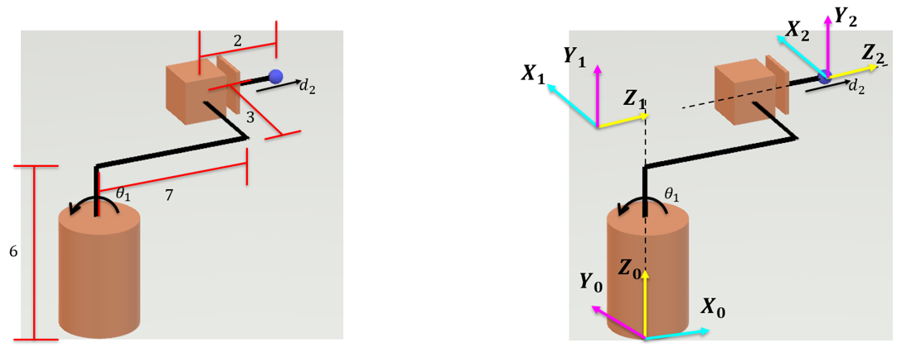
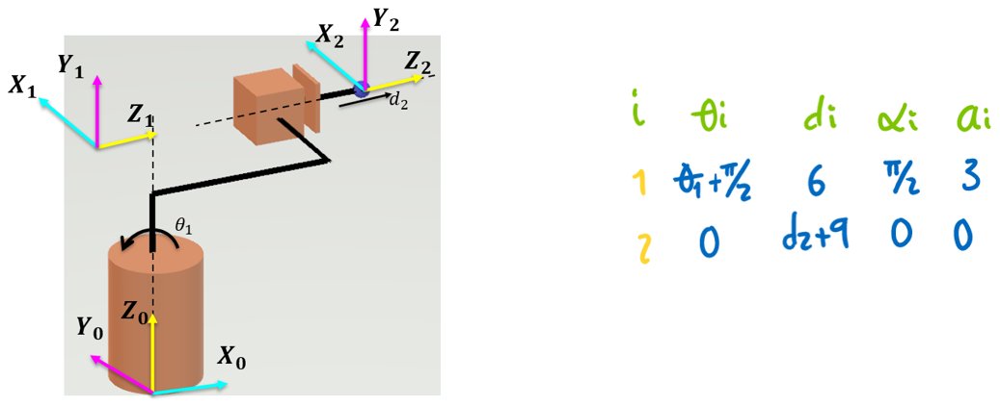
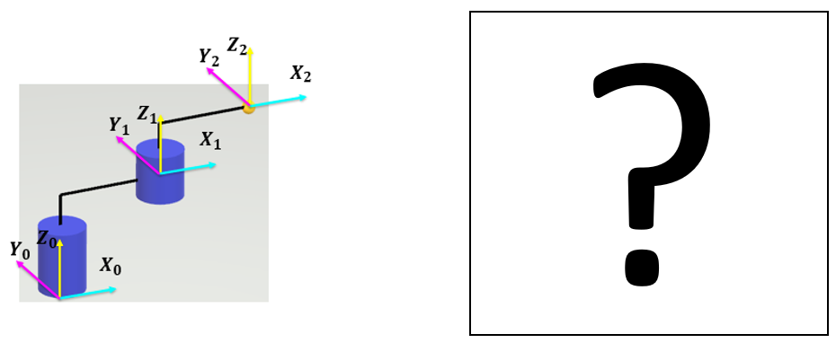

<h1>Aula 5</h1>

Esta clase consiste en comprender y aplicar el método DH (Denavit-Hartengerg) como solución de la cinemática directa de robots manipuladores seriales.

<h2>Método DH</h2>

El método Denavit Hartenberg (DH) fue propuesto en 1955 por Denavit y Hartenberg, el cual consiste en un método matricial que permite establecer de manera sistemática un sistema coordenado final con respecto al sistema coordenado de referencia. Para aplicar el método DH se deben tener en cuenta los siguientes pasos:

1. Asignar el sistema coordenado para cada articulación del robot
2. Determinar los parámetros DH (𝜃,𝑑,𝛼,𝑎), los cuales se utilizarán en el Toolbox Peter Corke de Matlab 
3. Obtener la siguiente matriz :

$$𝑇_𝑛^{𝑛−1}=𝑇𝑟𝑎𝑛𝑠_{𝑧_{𝑛−1}}(𝑑_𝑛) \cdot 𝑅𝑜𝑡_{𝑧_{𝑛−1}}(𝜃_𝑛) \cdot 𝑇𝑟𝑎𝑛𝑠_{𝑥_𝑛}(𝑎_𝑛) \cdot 𝑅𝑜𝑡_{𝑥_𝑛}(𝛼_𝑛)$$

<h3>Asignación de sistemas coordenados</h3>

Regla 1: El eje Z se debe ubicar en el eje de rotación si la articulación es rotacional o en la misma dirección de movimiento si es prismática.

Regla 2: El eje X debe ser perpendicular al eje Z de su mismo SC y al eje Z del anterior SC.

Regla 3: Todos los sistemas deben respetar la regla de la mano derecha (eje Y).

Regla 4: Cada eje X debe intersecar el eje Z del SC inmediatamente anterior.

<h4>Ejemplo 1</h4>


<h4>Ejemplo 2</h4>



<h4>Ejercicio 1</h4>


<h4>Ejercicio 2</h4>


<h3>Parámetros DH</h3>

Los parámetros DH (𝑑,𝜃,𝑎,𝛼) son definidos por las articulaciones y los eslabones del robot. 


Fuente: Barrientos, A., Peñín, L.F., Balaguer, C., y Aracil, R., 2007, Fundamentos de Robótica, 2nd edition, McGraw-Hill.

<h4>Párametro $𝜃_𝒊$</h4>

Es el ángulo que forman los ejes de $x_{𝑖−1}$ a $x_𝑖$ perpendicular al eje $z_{𝑖−1}$


<h4>Párametro $𝒅_𝒊$</h4>

Es la distancia de $𝑋_{𝑖−1}$ a $𝑋_𝑖$ a lo largo del eje $𝑍_{𝑖−1}$


<h4>Párametro $𝜶_𝒊$</h4>

Es el ángulo que forman los ejes de $𝑍_{𝑖−1}$ a $𝑍_𝑖$ perpendicular al eje $𝑋_𝑖$


<h4>Párametro $𝒂_𝒊$</h4>

Es la distancia de $𝑍_{𝑖−1}$ a $𝑍_𝑖$ a lo largo del eje $𝑋_𝑖$


<h4>Ejemplo 1</h4>


```matlab
clear all
close all
clc

%Peter corke
a1 = 12;
a2 = 14;
a3 = 6;
a4 = 4;

q1 = 0;%Theta1
q2 = 0;%Theta2

R(1) = Link('revolute','d',a1,'alpha',pi/2,'a',a2,'offset',0);
R(2) = Link('revolute','d',a3,'alpha',0,'a',a4,'offset',0);

Robot = SerialLink(R,'name','Bender')

Robot.plot([q1,q2],'scale',1.0,'workspace',[-30 30 -30 30 -30 30]);
zlim([-15,30]);
Robot.teach([q1,q2],'rpy/zyx');
MTH = Robot.fkine([q1,q2])
```

<h4>Ejemplo 2</h4>



```matlab
clear all
close all
clc

l1 = 6;
l2 = 7;
l3 = 3;
l4 = 2;

q1 = 0;
q2 = 0;

R(1) = Link('revolute','d',l1,'alpha',pi/2,'a',l3,'offset',pi/2);
R(2) = Link('prismatic','theta',0,'alpha',0,'a',0,'offset',l2+l4);
R(2).qlim = [0,10];

Robot = SerialLink(R,'name','Bender')

Robot.plot([q1,q2],'scale',1.0,'workspace',[-30 30 -30 30 -30 30]);
zlim([-15,30]);
Robot.teach([q1,q2],'rpy/zyx');
MTH = Robot.fkine([q1,q2])
```

<h4>Ejercicio 1</h4>



```matlab
clear all
close all
clc

a1 = 10;
a2 = 11;
a3 = 5;
a4 = 12;

q1 = 0;
q2 = 0;

R(1) = Link('revolute','d',a1,'alpha',0,'a',a2,'offset',0);
R(2) = Link('revolute','d',a3,'alpha',0,'a',a4,'offset',0);

Robot = SerialLink(R,'name','Bender')

Robot.plot([q1,q2],'scale',1.0,'workspace',[-30 30 -30 30 -30 30]);
zlim([-15,30]);
Robot.teach([q1,q2],'rpy/zyx');
MTH = Robot.fkine([q1,q2])
```

<h4>Ejercicio 2</h4>


```matlab
clear all
close all
clc

a1 = 15;
a2 = 5;
a3 = 8;
a4 = 5;
a5 = 6;

q1 = 0;
q2 = 0;
q3 = 0;
q4 = 0;

R(1) = Link('revolute','d',a1,'alpha',0,'a',a2,'offset',0);
R(2) = Link('revolute','d',0,'alpha',pi,'a',a3,'offset',0);
R(3) = Link('prismatic','theta',0,'alpha',0,'a',0,'offset',a4);
R(3).qlim = [0,10];
R(4) = Link('revolute','d',a5,'alpha',0,'a',0,'offset',0);

Robot = SerialLink(R,'name','Bender')

Robot.plot([q1,q2,q3,q4],'scale',0.5,'workspace',[-30 30 -30 30 -30 30]);
zlim([-15,30]);
Robot.teach([q1,q2,q3,q4],'rpy/zyx');
MTH = Robot.fkine([q1,q2,q3,q4])
```

<h3>Matriz DH</h3>

