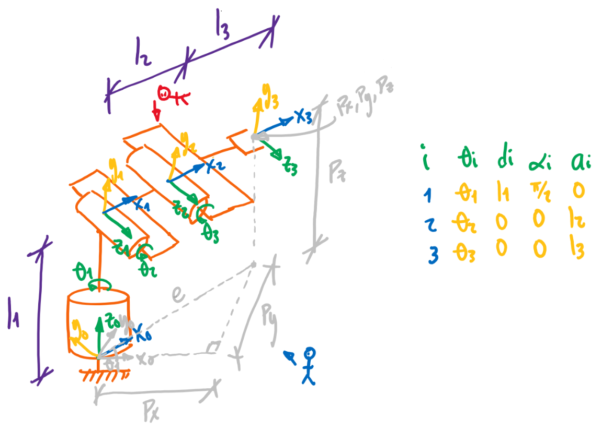
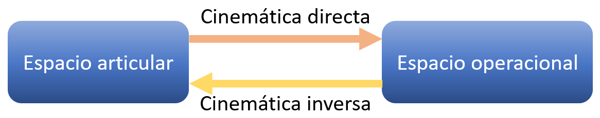
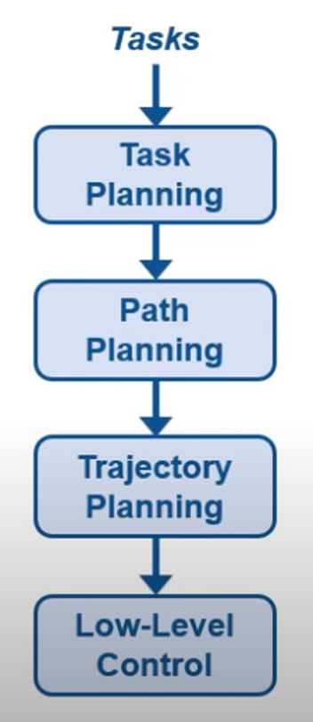
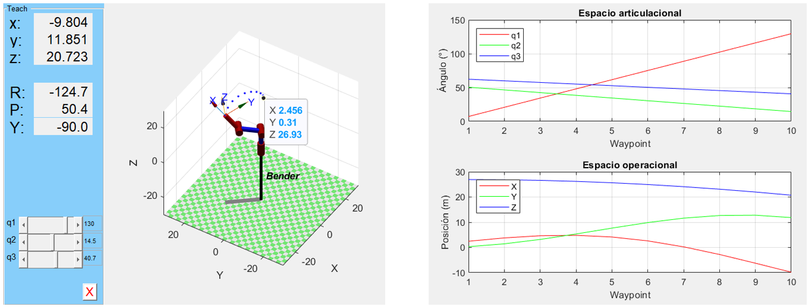
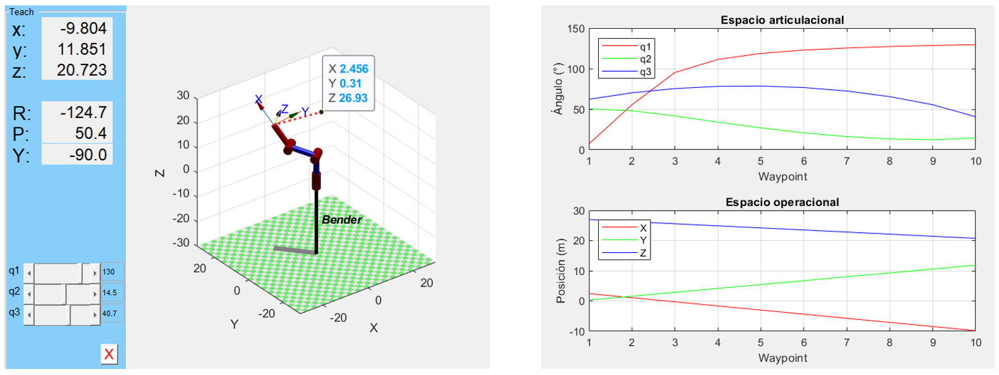
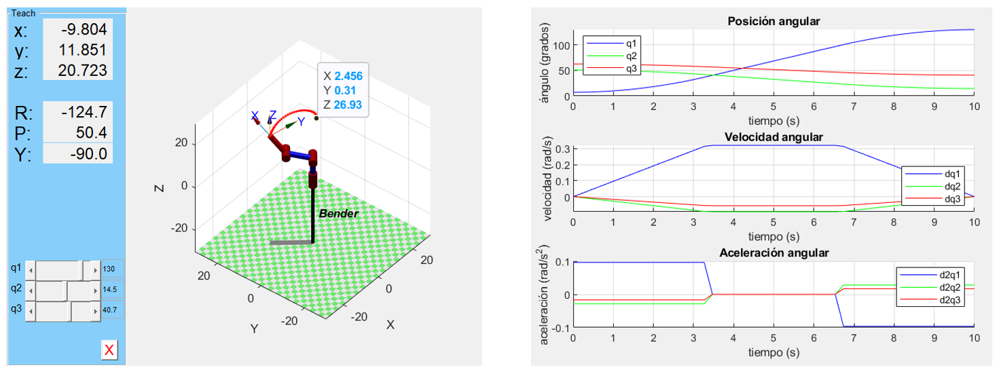

<h1>Aula 9</h1>

Esta clase consiste en comprender y analizar la cinemática inversa de dos robots 3R, así como las rutas y las trayectorias con perfil de velocidad trapezoidal.

<h2>Robot 3R (planar)</h2>

<h2>Robot 3R</h2>

<h3>Theta 1</h3>

$$𝜃_1=tan^{−1}\frac{⁡𝑃_𝑦}{𝑃_𝑥}$$

$$𝑒=\sqrt{𝑃_𝑥^2+𝑃_𝑦^2}$$

<h3>Theta 3</h3>

$$𝑐=𝑃_𝑧−𝑙_1$$

$$𝑏=\sqrt{𝑒^2+𝑐^2}$$

$$cos𝜃_3=\frac{𝑏^2−𝑙_3^2−𝑙_2^2}{2\cdot𝑙_2\cdot𝑙_3}$$

$$sin⁡𝜃_3=±\sqrt{1−(cos𝜃_3)^2}$$

$$𝜃_3=tan^{−1}\frac{sin𝜃_3}{cos𝜃_3}$$

<h3>Theta 2</h3>

$$𝛼=tan^{−1}⁡\frac{𝑐}{𝑒}$$

$$∅=tan^{−1}\frac{𝑙_3 \cdot sin⁡𝜃_3}{𝑙_2+𝑙_3 \cdot cos⁡𝜃_3}$$

$$𝜃_2=𝛼−∅$$

<h2>Trayectorias</h2>

Las trayectorias de los robots consisten en realizar tareas de movimiento del robot de un punto inicial a un punto final, en el espacio articular (espacio de movimientos de las articulaciones) o en el espacio operacional del robot (espacio (área o volumen) de trabajo).

<h3>Planeación de ruta (<i>path planning</i>)</h3>

Genera una ruta geométrica, desde un punto inicial hasta un punto final a través de puntos intermedios (waypoints) previamente definidos de manera discontinua (saltos bruscos), donde solo es relevante la posición.

Las rutas con puntos intermedios a través de la interpolación de ángulos del punto A y B generan un resultado circular (MoveJ).

Las rutas con puntos intermedios a través de la interpolación de posiciones del punto A y B generan un resultado lineal (MoveL).

<h3>Planeación de trayectoria (<i>trajectory planning</i>)</h3>

A partir de una ruta geométrica determinada, se genera una trayectoria continua (movimiento suave) en función del tiempo, es decir, contemplando las velocidades y las aceleraciones de las articulaciones.

Las trayectorias se pueden obtener a través de diferentes métodos:

- Polinomios
- Perfil de velocidad trapezoidal
- Jacobianos  

<h4>Perfil de velocidad trapezoidal</h4>

El perfil de velocidad trapezoidal es realizado en el espacio de las articulaciones. Una de las combinaciones más utilizadas en este perfil es 1/4, 1/2, 1/4; sin embargo, esto depende de la velocidad máxima y el tiempo final.

$$𝑉𝑚á𝑥=\frac{𝑑_1−𝑑_0}{𝑡_𝑓} \cdot 1.5$$

