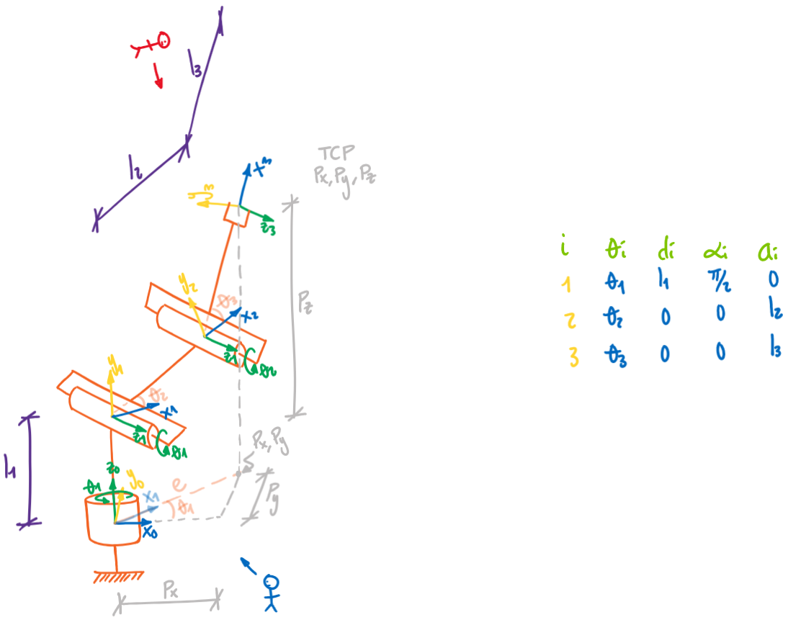

<h1>Aula 9</h1>

Esta clase consiste en comprender y analizar la cinemática inversa de dos robots 3R, así como las rutas y las trayectorias con perfil de velocidad trapezoidal.

<h2>Robot 3R (planar)</h2>

<h2>Robot 3R</h2>

<h3>Theta 1</h3>

$$𝜃_1=tan^{−1}\frac{⁡𝑃_𝑦}{𝑃_𝑥}$$

$$𝑒=\sqrt{𝑃_𝑥^2+𝑃_𝑦^2}$$

<h3>Theta 3</h3>

$$𝑐=𝑃_𝑧−𝑙_1$$

$$𝑏=\sqrt{𝑒^2+𝑐^2}$$

$$cos𝜃_3=\frac{𝑏^2−𝑙_3^2−𝑙_2^2}{2\cdot𝑙_2\cdot𝑙_3}$$

$$sin⁡𝜃_3=±\sqrt{1−(cos𝜃_3)^2}$$

$$𝜃_3=tan^{−1}\frac{sin𝜃_3}{cos𝜃_3}$$

<h3>Theta 2</h3>

$$𝛼=tan^{−1}⁡\frac{𝑐}{𝑒}$$

$$∅=tan^{−1}\frac{𝑙_3 \cdot sin⁡𝜃_3}{𝑙_2+𝑙_3 \cdot cos⁡𝜃_3}$$

$$𝜃_2=𝛼−∅$$

<h3>Ruta (<i>path</i>)</h3>

<h3>Trayectoria (<i>trajectory</i>)</h3>