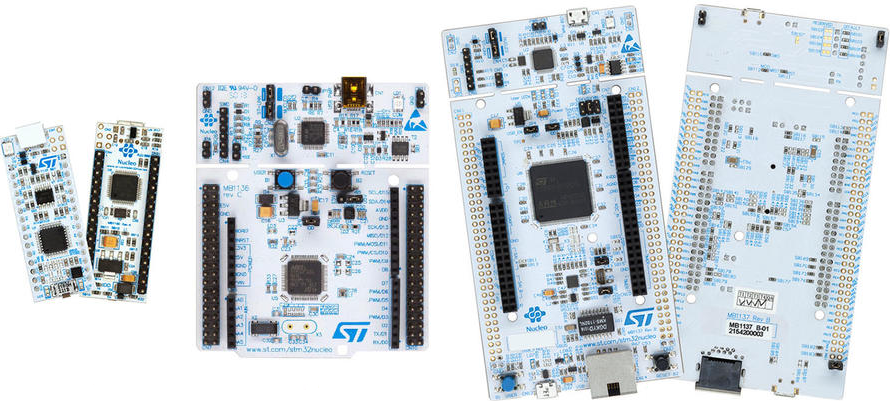
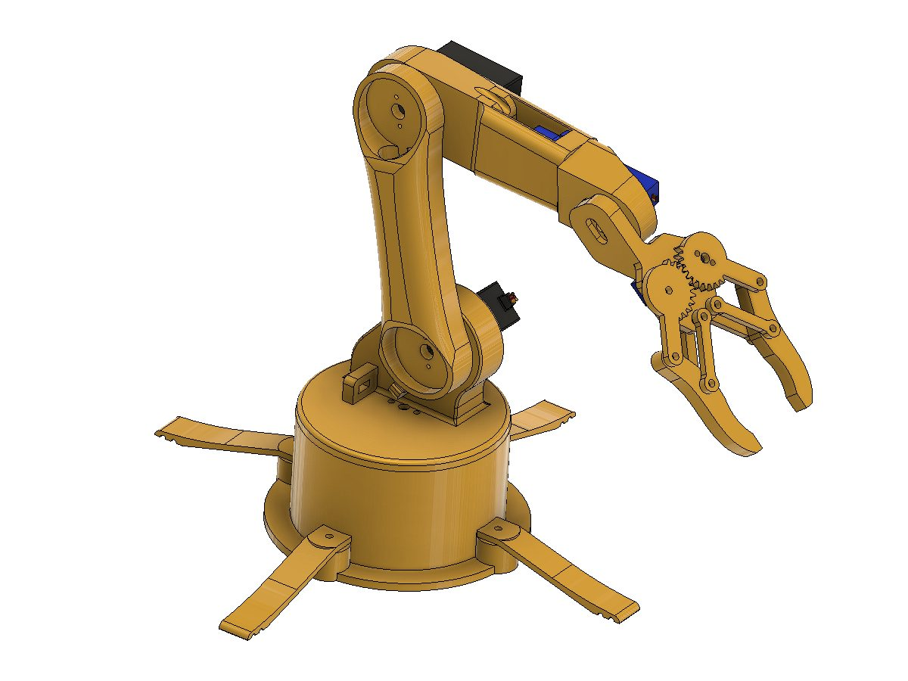
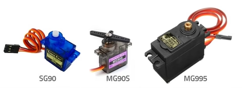

<h1 align="center">Profesor: MSc. Fabián Barrera Prieto 👨‍🏫 
Materia: Teoría de robótica 🦾 
Universidad: UMNG 🏫 
Año: 2024 📅</h1> 

La teoría de robótica está enfocado al estudio y desarrollo de brazos manipuladores teniendo en cuenta las cinemáticas directas e inversas de cada robot de configuración serial. Este curso tiene un valor del 70% en la nota del primer y segundo corte del curso y del 50% en la nota del tercer corte del curso.

<h1>Aula 1</h1>

En esta clase se presenta la materia, en cuanto al contenido temático, los métodos de evaluación, las observaciones, las NO EXCUSAS y los recursos para el desarrollo del curso.

<h2>Presentación de la materia 🚀</h2>

<h3>TEMAS 🤓</h3>

<h4>Primer corte</h4>

<table>
	<tr>
		<td>Fecha</td> <td>Horas</td> <td>Clase</td> <td>Semana</td> <td>Actividades</td>
	</tr>
	<tr>
		<td>26/07/2024</td> <td>2</td> <td>1</td> <td>1</td> <td>Presentación de la materia</td>
	</tr>
	<tr>
		<td>02/08/2024</td> <td>2</td> <td>2</td> <td>2</td> <td>Posición y orientación del cuerpo rígido y matrices de rotación</td>
	</tr>
	<tr>
		<td>09/08/2024</td> <td>2</td> <td>3</td> <td>3</td> <td>Matrices de transformación homogénea</td>
	</tr>
	<tr>
		<td>16/08/2024</td> <td>2</td> <td>4</td> <td>4</td> <td>Introducción a la cinemática directa y convención Denavit Hartenberg para robots manipuladores</td>
	</tr>
	<tr>
		<td>23/08/2024</td> <td>2</td> <td>5</td> <td>5</td> <td>Parcial primer corte</td>
	</tr><!--semana de parciales del primer corte-->
	<tr>
		<td>30/08/2024</td> <td>2</td> <td>6</td> <td>6</td> <td>Retroalimentación del parcial primer corte y entrega de notas primer corte</td>
	</tr><!--última semana de registro de notas del primer corte-->
</table>

<h4>Segundo corte</h4>

<table>
	<tr>
		<td>Fecha</td> <td>Horas</td> <td>Clase</td> <td>Semana</td> <td>Actividades</td>
	</tr>
	<tr>
		<td>06/09/2024</td> <td>2</td> <td>7</td> <td>7</td> <td>Introducción a la cinemática inversa con 2R</td>
	</tr>
	<tr>
		<td>13/09/2024</td> <td>2</td> <td>8</td> <td>8</td> <td>Cinemática inversa de robot manipulador 3R</td>
	</tr>
	<tr>
		<td>20/09/2024</td> <td>2</td> <td>9</td> <td>9</td> <td>Rutas y trayectorias</td>
	</tr>
	<tr>
		<td>27/09/2024</td> <td>2</td> <td>10</td> <td>10</td> <td>Desacople cinemático 6R</td>
	</tr>
	<tr>
		<td>04/10/2024</td> <td>2</td> <td>11</td> <td>11</td> <td>Parcial segundo corte</td>
	</tr>
	<tr>
		<td>11/10/2024</td> <td></td> <td></td> <td></td> <td>SEMANA DE RECESO</td>
	</tr><!--semana de parciales del segundo corte-->
	<tr>
		<td>18/10/2024</td> <td>2</td> <td>12</td> <td>12</td> <td>Retroalimentación del parcial segundo corte y entrega de notas segundo corte</td>
	</tr><!--última semana de registro de notas del primer corte-->
</table>

<h4>Tercer corte</h4>

<table>
	<tr>
		<td>Fecha</td> <td>Horas</td> <td>Clase</td> <td>Semana</td> <td>Actividades</td>
	</tr>
	<tr>
		<td>25/10/2024</td> <td>2</td> <td>13</td> <td>13</td> <td>Jacobiano analítico y geométrico</td>
	</tr>
	<tr>
		<td>01/11/2024</td> <td>2</td> <td>14</td> <td>14</td> <td>Control cinemático</td>
	</tr>
	<tr>
		<td>08/11/2024</td> <td>2</td> <td>15</td> <td>15</td> <td>Plataforma diferencial</td>
	</tr>
	<tr>
		<td>15/11/2024</td> <td>2</td> <td>16</td> <td>16</td> <td>Examen final</td>
	</tr><!--Finalización de clases-->
	<tr>
		<td>22/11/2024</td> <td>2</td> <td>17</td> <td>17</td> <td>Retroalimentación del examen final y entrega de notas del tercer corte</td>
	</tr>
</table>

<h3>MÉTODOS DE EVALUACIÓN ✍️</h3>

<table>
	<tr>
		<td>Corte</td>
		<td>Actividad</td>
		<td>Porcentaje 💯</td>
		<td>Fecha</td>
		<td>Metodología</td>
	</tr>
	<tr>
		<td rowspan="2">Primer (21%)</td>
		<td>Parcial</td>
		<td>13.65%</td>
		<td>23/08/2024</td>
		<td rowspan="7">Presencial</td>
	</tr>
	<tr>
		<td>Quices y/o talleres</td>
		<td>7.35%</td>
		<td>09/08/2024 16/08/2024</td>
	</tr>
	<tr>
		<td rowspan="2">Segundo (21%)</td>
		<td>Parcial</td>
		<td>13.65%</td>
		<td>04/10/2024</td>
	</tr>
	<tr>
		<td>Quices y/o talleres</td>
		<td>7.35%</td>
		<td>13/09/2024 20/09/2024 27/09/2024</td>
	</tr>
	<tr>
		<td rowspan="3">Tercer (20%)</td>
		<td>Examen final</td>
		<td>15%</td>
		<td>22/11/2024</td>
	</tr>
	<tr>
		<td>Quices y/o talleres</td>
		<td>5%</td>
		<td>01/11/2024 08/11/2024 15/11/2024</td>
	</tr>
</table>

Nota del curso = (***0.21***+0.09)*NotaCorte1 + (***0.21***+0.09)*NotaCorte2 + (***0.2***+0.2)*NotaCorte3

<h3>OBSERVACIONES ⚠️</h3>

<h4>Observaciones de clase</h4>
	<ul>
		<li> Inicio de clases: Quince (15) minutos después de la hora inicial definida de la clase y el control de asistencia se realiza a cada inicio de clase ⌚</li>
		<li> Fin de clases: Quince (15) minutos antes de la hora final definida de la clase ⏱️</li>
		<li> Respeto en clase 🤝</li>
		<li> No presto mi computador para presentar laboratorios, talleres y/o proyectos 🤦‍♂️</li>
		<li> Prohibido el uso de celular en quices, parciales y clase 📵</li>
		<li> Permitidas las salidas al baño 🚻 y a recibir llamadas 📲, en los quices y parciales se debe dejar el celular en el puesto para salir al baño</li>
		<li> Si no dejan dictar la clase, pasan al tablero a dar la clase o doy la clase por vista 😤</li>
		<li> No es permitido tomar fotos, ni videos en clase 📵. El material de clase está en el siguiente repositorio git: https://github.com/FBarreraP/Teoria_Robotica </li>
		<li> Los laboratorios y el proyecto consistirán únicamente de montaje y podrán ser realizados en grupos de máximo 2 estudiantes 🧍‍♂️🧍‍♀️</li>
		<li> Los montajes realizados en protoboard no son aceptados con jumpers, por tanto, deben ser realizados con cable UTP y no son compartidos, es decir, un montaje por grupo 🤷‍♂️</li>
		<li> Los talleres se calificarán con rúbricas de 0.0 a 5.0 con intervalo de 1.0; las cuales tendrán diferentes entregables con fechas fijas de entrega y el orden de entrega de los grupos será definida por el profesor 💥</li> 
		<li> Los parciales y el examen final serán solucionados en hoja examen 📄</li> 
		<li> Quien llegue tarde se adelanta en el tema visto hasta el momento 🏃‍♂️</li> 
	</ul>

<h4>Observaciones de reglamento estudiantil</h4>
<ul>
	<li> Revisión sobre la calificación solamente dentro de los dias (3) establecidos en el reglamento estudiantil </li>
	<li> Con el 20% de las fallas se pierde la materia</li>
	<li> Las ausencias a clases donde se saque una calificación se debe presentar la excusa familiar o laboral en la dirección del programa</li>
</ul>

<h3>NO EXCUSAS ❌</h3>

<ul>
	<li> Hace 5 minutos funcionaba (tengo un video funcionando) 😒</li>
	<li> Mi compañero tiene todo y no ha llegado 😐</li>
	<li> Mírelo ya, porque deja de funcionar 🤨</li>
	<li> Tengo más materias 🙄</li>
	<li> Trabajo y estudio 😶</li>
	<li> Se dañó en el bus 🤔</li>
	<li> No lo toque, no lo mire, ni se acerque mucho porque se daña 🤨</li>
</ul>

<h3>RECURSOS 🛠️</h3>

<ul>
	<li> Computador 💻</li>
	<li> Matlab</li>
	<li> STM-32</li>
	
	<!--
	<li> Plataforma diferencial</li>
    
	<li> Motoreductor DC</li>
    
	
	-->
	<li> Brazo robótico 5 GDL</li>
	
	<li> Servomotores SG90 o MG90</li>
    
</ul>

<h3>Bibliografía </h3>

<ul>
	<li> Siciliano, Bruno; Sciavicco, Lorenzo. Robotics - Modelling, Planning and Control. Springer, 2009.</li> 
	<li> Peter Corke, Robotics, Vision and Control - Fundamental Algorithms in MATLAB, Springer, 2017.</li>
	<li> Murray, Richard. A mathematical Introduction to Robotic manipulation</li>
	<li> Siegwart, Roland. Introduction to Autonomous Mobile Robots</li>
	<li> Jean Claude Latombe, Robot Motion Planning.</li>
	<li> Howie Choset, Principles of Robot Motion: Theory, Algorithms, and Implementations</li>
	<li> Fu King, Gonzales R. Robotics: Control, Sensing, Vision, and Intelligence.</li>
	<li> Jones, Joseph. Mobile robots, Inspiration to Implementation</li>
	<li> Niku, Saeed. Introduction to robotics: analysis, systems, applications.</li>
	<li> Angulo José, Robótica Tecnología y Aplicaciones.</li>
	<li> Barrientos A. Fundamentos de Robótica.</li>
	<li> Kelly Rafael, Santibañez Victor. Control de Movimiento de Robots Manipuladores.</li>
	<li> Ollero, Anibal. Robótica: Manipuladores y Robots Móviles.</li>
</ul>
